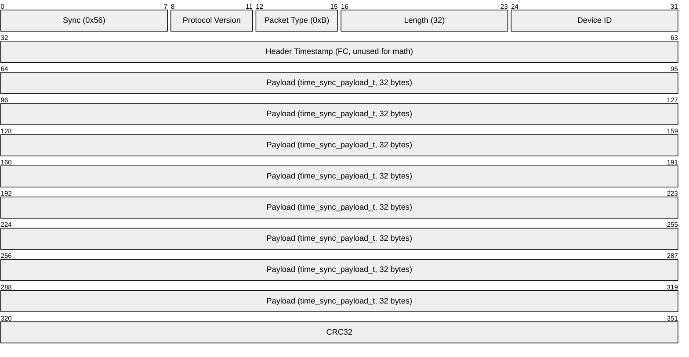

# Time Sync (0xB) — design & implementation plan

Status: **proposed** (not yet implemented). This document specifies an overhaul of
clock synchronization between the flight controller (FC) and the navigator (GCS),
replacing the one-way heartbeat clock-jam with an NTP-style handshake plus FC-side
clock discipline.

## Motivation

Today sync is a crude one-way jam. Each `syncPeriodMs` (default 5 s) the GCS sends a
[heartbeat](heartbeat.md) (`0x0`) carrying its wall-clock ms; the FC, on receipt,
**hard-overwrites** its clock offset (`set_timestamp()`, `src/sys/sys_utils.c:27-31`)
so FC-clock = GCS *send* time. Problems:

1. **No latency compensation** — the FC clock is pinned to the GCS *send* instant, so
   it lags by the uplink one-way delay.
2. **Step discontinuities** — every sync hard-jams the offset, so FC timestamps can
   jump forward/backward. Bad for on-board/SD logging and graph alignment.
3. **Conflated diagnostic** — the GCS "Diff" (`MainWindow.cpp:1488-1492`,
   `gcs_now − fc_ts`) mixes clock offset + FC queue delay + downlink latency, hence
   the 40–150 ms WiFi jitter. Telemetry timestamps are never corrected.

**Goal:** a 4-timestamp handshake that separates **offset** from **delay**; a GCS-side
filtered estimator tracking offset + skew that corrects telemetry into one timeline;
an FC that **slews** its clock smoothly (monotonic, no backward jumps); and a
trustworthy, jitter-filtered latency/offset readout in the status bar.

## Packet structure

New packet type `PACKET_TYPE_TIME_SYNC = 0xB` (next free after `PERF_TASKNAME = 0xA`,
`include/comm/comm_types.h`). The header `Timestamp` field keeps its normal meaning
(FC stamp at serialization) and is **not** used for sync math; sync timestamps live in
the payload. The GCS is the initiator. One type, two roles.



### Payload — `time_sync_payload_t` (32 bytes, little-endian)

| Offset | Size | Field                 | Filled by | Meaning                                   |
| ------ | ---- | --------------------- | --------- | ----------------------------------------- |
| 0      | 1    | `role`                | sender    | 0 = REQUEST (GCS→FC), 1 = RESPONSE (FC→GCS)|
| 1      | 1    | `seq`                 | GCS       | request sequence, echoed in the response  |
| 2      | 2    | `_pad`                | —         | reserved, zero                            |
| 4      | 8    | `t1_gcs_tx` (u64 ms)  | GCS       | GCS wall-clock at send; echoed by FC      |
| 12     | 8    | `t2_fc_rx`  (u64 ms)  | FC        | FC clock at receive (response only)       |
| 20     | 8    | `t3_fc_tx`  (u64 ms)  | FC        | FC clock at response serialize            |
| 28     | 4    | `commanded_offset_ms` (i32) | GCS | clock correction for FC; `INT32_MIN` = none |

**T4** = GCS wall-clock ms captured when the response is parsed (not on the wire).

```c
typedef enum { TIME_SYNC_REQUEST = 0x00, TIME_SYNC_RESPONSE = 0x01 } time_sync_role_t;

typedef struct __attribute__((packed)) {
  uint8_t  role;
  uint8_t  seq;
  uint8_t  _pad[2];
  uint64_t t1_gcs_tx;
  uint64_t t2_fc_rx;
  uint64_t t3_fc_tx;
  int32_t  commanded_offset_ms;   // INT32_MIN = "no command"
} time_sync_payload_t;            // 32 bytes
```

### Math (on the GCS)

```
offset = ((t2 − t1) + (t3 − t4)) / 2     // FC − GCS
delay  = (t4 − t1) − (t3 − t2)           // round-trip transit (≥ 0)
```

FC stamps are widened to `uint64` (`(uint64_t)get_timestamp_unix()`) so the payload is
uniform and survives the FC's 32-bit ms wrap (~49.7 days). All estimation lives on the
GCS (unit-testable); the FC is a pure disciplined slave that applies
`commanded_offset_ms` when present, else freewheels. Heartbeat `0x0` is retained for
the LIVE pill / liveness only; its Diff math is removed. Firmware that ignores `0xB`
never responds → GCS shows "unsynced".

## Firmware changes

- **`include/comm/comm_types.h`** — add the enum value, `time_sync_role_t`, and
  `time_sync_payload_t` with the byte-layout doc comment.
- **`src/sys/sys_utils.{c,h}`** — remove the hard-jam; add a disciplined offset:
  - State: `_offset_target`, `_offset_applied` (float), `_skew_integral`, `_last_unix`.
  - `get_timestamp_unix()` returns `max(_last_unix, ticks/10 + (int32)_offset_applied)`
    — **never decreases** (a downward correction stalls, never reverses). Key for SD
    logging. (`HIGH_FREQ_TIMER_FREQ/1000 = 10`.)
  - Replace `set_timestamp()` with `time_sync_set_offset(int32_t)` → sets target.
  - `time_sync_discipline_tick()` (slew/PI), called from the telemetry loop:
    ```
    err  = _offset_target − _offset_applied;
    slew = clamp(KP*err + KI*_skew_integral, ±MAX_SLEW_MS_PER_S);  // KP≈0.1 KI≈0.002, ±50 ms/s
    if (|slew| < MAX_SLEW) _skew_integral += err * dt_s;           // anti-windup
    _offset_applied += slew * dt_s;
    if (|err| > BOOTSTRAP_MS) { _offset_applied = _offset_target; _skew_integral = 0; }  // cold start / re-acquire
    ```
    DWT loop-dt (`variables.h:22-30`) is a separate clock — untouched.
- **`src/comm/comm_processor.c`** (`comm_processor_dispatch`) — remove the
  `HEARTBEAT → set_timestamp` block (`:43-45`); add a `TIME_SYNC` handler: capture
  `t2` first; if `role==REQUEST`, reply with a RESPONSE (echo `seq`+`t1`, fill `t2`,
  fill `t3` just before send) via `send_packet(&g_telemetry_channel, …)` (same pattern
  as `PERF_TASKNAME`); if `commanded_offset_ms != INT32_MIN`, call
  `time_sync_set_offset(-offset)`. Ignore `role==RESPONSE`.
- **`src/comm/telemetry_task.c`** — call `time_sync_discipline_tick()` once per loop
  iteration (`:53-79`). Outgoing stamping unchanged (now smooth + monotonic).
  Serializer unchanged (32-byte payload fits; CRC handled).

## GCS changes

- **New `software/src/protocol/TimeSyncEstimator.{h,cpp}`** (pure, headless-testable):
  - `addSample({t1,t2,t3,t4})` → per-sample offset/delay; reject `delay<0`,
    implausible, or stale/duplicate `seq`.
  - **Jitter filter:** sliding window (~8); adopt the **minimum-delay** sample's offset
    (SNTP best-sample), smoothed with an EWMA.
  - **Skew:** EWMA of `d(offset)/dt` → `skewPpm`.
  - `fcToGcs(fcMs, gcsNow)` projects FC time onto the GCS timeline (offset + skew);
    guards a ±2^32 ms FC-wrap jump.
  - `synced()` after ≈3 consistent samples; `offsetMs()`, `delayMs()`, `reset()`.
- **`software/src/protocol/DroneProtocol.{h,cpp}`** — add a `0xB` branch in
  `parseBuffer()` (near `:111-117`); capture `t4` in the parser (worker thread → less
  jitter); emit `timeSyncResponse(seq, t1,t2,t3, t4)`. Add `0xB → "TIME_SYNC"` to the
  analyzer's type-string map. Keep `heartbeatReceived` for liveness.
- **`software/src/ui/main/MainWindow.{h,cpp}`**:
  - Own `TimeSyncEstimator m_tsEst;` and `quint8 m_syncSeq;`.
  - Rewrite `onTimeSyncRequested()` (`:1499-1521`) to send a `0xB` REQUEST
    (`role=0, seq++, t1=now, commanded_offset_ms = synced() ? -offsetMs() : INT32_MIN`)
    via `sendToFc()` (keeps the replay tx-guard, `:878-891`).
  - New slot `onTimeSyncResponse(...)` → `addSample`, push corrected state to the
    engine, refresh the Diff from the filtered estimate.
  - Strip Diff math from `onHeartbeatReceived()` (`:1478-1496`); leave LIVE pill +
    `m_lastHbTime`.
  - Wire the new signal near `:146`; fix hardcoded `m_syncTimer->start(5000)` (`:1296`)
    → `start(m_settings.syncPeriodMs)`; `m_tsEst.reset()` on disconnect (`:1300`).
- **`software/src/ui/main/MainStatusBar.{h,cpp}`** — change the readout to a filtered
  one: primary = one-way latency (`delayMs`), residual offset on the tooltip; rebase
  color bands (e.g. <5 green / <20 amber / else red); "--" greyed when `!synced()`.
- **Settings** — `syncPeriodMs` already exists (`SettingsWidget.cpp:362-372`, applied
  `MainWindow.cpp:1120`); just honor it on connect. Optional `clockDiscipline` toggle
  (display-only "monitor mode") via the `atEnd()` sentinel pattern in
  `SettingsManager.h`.

## Corrected timeline (graphs / logging / replay)

`TimeSyncEstimator::fcToGcs()` is the single conversion point, applied in
`software/src/protocol/TelemetryEngine.cpp` where packets are recorded (today it stamps
`lastImuMs = currentMSecsSinceEpoch()` and discards the FC `DecodedPacket.timestamp`,
`:75-109`). Add a queued `setTimeSync(offsetMs, skewPpm, synced)` setter, store a
corrected `fcTimeMs` on `VehicleState` for graph x-axes. **Replay:** gate the estimator
feed on `!replayMode` (REQUESTs already blocked by `sendToFc`); fall back to the FC's
own `decoded.timestamp` (recorded stream is self-consistent). `RecordSink` frame stamps
unchanged.

## Tests

Add under `software/tests/` (mirror `navigator_test(...)`, see `tst_command_codec`,
`software/tests/CMakeLists.txt:26-30`):

1. **`tst_time_sync_estimator.cpp`** — textbook NTP vectors → exact offset/delay;
   min-delay selection under asymmetric jitter; skew recovery + `fcToGcs` projection;
   rejection of negative-delay / out-of-order samples; FC u32-wrap stability.
2. **`tst_time_sync_codec.cpp`** (optional) — round-trip the REQUEST/RESPONSE byte
   layout to lock the wire format.

Register `TimeSyncEstimator.cpp` in `software/CMakeLists.txt` (after
`src/protocol/PacketDecoder.cpp`) and in the new test targets. Build:
`cmake --build software/build -j"$(nproc)"`; run:
`ctest --test-dir software/build/tests -R tst_time_sync`.

## Risks / edge cases

- **u32 ms wrap (49.7 d):** payload is u64 absolute; estimator works in offset space;
  `fcToGcs` guards a ±2^32 jump; `reset()` on disconnect avoids stale wrap.
- **Cold start:** unsynced → `commanded_offset = INT32_MIN`; FC freewheels until ≥3
  consistent samples; first command may bootstrap-step (never reverses via `_last_unix`).
- **Backward jumps:** prevented by the monotonic floor + slew clamp.
- **Link loss/resync:** `reset()` on disconnect; FC holds last applied offset.
- **SITL:** loopback ≈ 0 delay/offset — first correctness check.
- **CRC-off debug** (`m_checkCrc=false`): estimator still rejects implausible samples.

## Rollout / verification order

1. Land `TimeSyncEstimator` + unit tests (pure). Green `ctest`.
2. Add packet type + payload + DroneProtocol parse + codec test.
3. Wire GCS request/response + filtered Diff (**monitor mode**, no FC discipline).
   Run GCS headless (Xvfb `:99`, `QT_QPA_PLATFORM=xcb`) vs SITL; offset≈0, delay≈0.
4. Add FC discipline (slew/PI) + telemetry-task tick; inject an offset step in SITL,
   confirm smooth + monotonic `get_timestamp_unix()`.
5. Apply corrected timeline in TelemetryEngine/VehicleState; confirm graph alignment +
   replay.
6. **Hardware:** flash; test over UART 230400, then the UDP/WiFi bridge; confirm the
   filtered latency/offset is stable where the raw subtraction was noisy.

## Changelog

| Date       | Author          | Description                          |
| ---------- | --------------- | ------------------------------------ |
| 15/06/2026 | ragnar-vallhala | Initial design & implementation plan |
