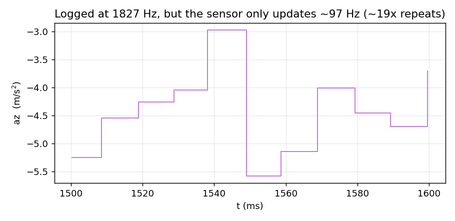
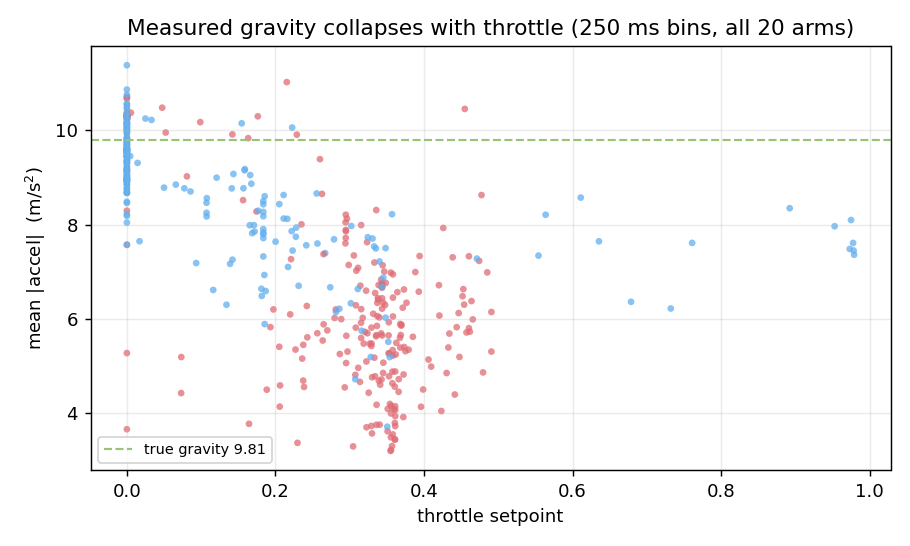
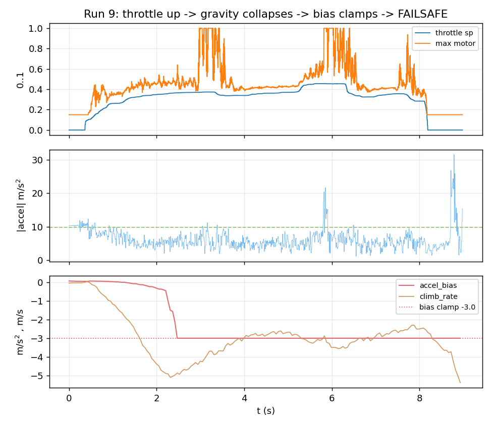
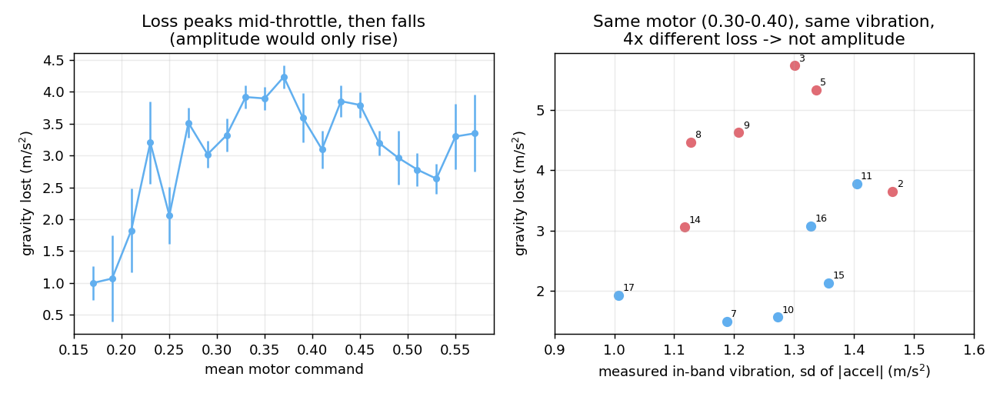
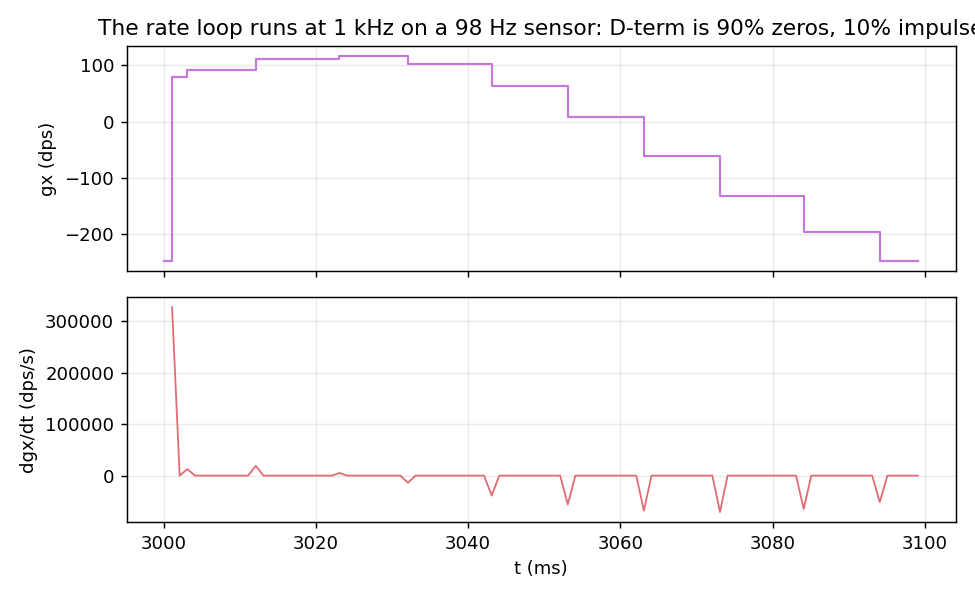

# Findings

## 1. The driver never configures the IMU

`bmx160_acc_range`, `bmx160_acc_odr`, `bmx160_acc_bwp`, `bmx160_acc_us` and
their gyro counterparts are assigned in exactly one place in the whole tree —
`src/sensor/bmx160.c:697-712`, which **reads them back off the chip**:

```c
config->bmx160_acc_us   = GET_ACC_US(rx_buf[0]);
config->bmx160_acc_bwp  = GET_ACC_BWP(rx_buf[0]);
config->bmx160_acc_odr  = GET_ACC_ODR(rx_buf[0]);
config->bmx160_acc_range = GET_ACC_RANGE(rx_buf[0]);   // line 708
```

A register-writing path exists (`bmx160.c:780-833`, packing `ACC_CONF` and
`ACC_RANGE`) but **is never called**. `bmx160_init()` verifies the chip ID,
loads the SD calibration, and starts sampling. The BMX160 therefore sits at its
power-on reset values for the entire life of the flight controller:

| register | POR value | meaning |
|---|---|---|
| `ACC_CONF` 0x40 | `0x28` | us=0, bwp=2 (normal), **odr=8 → 100 Hz** |
| `ACC_RANGE` 0x41 | `0x03` | **±2 g** |
| `GYR_CONF` 0x42 | `0x28` | **odr=8 → 100 Hz** |

Both are confirmed by the recording itself rather than inferred:

- the `FMT` frame carries the accel scale the firmware computed at boot,
  `0.0005985504 m/s²/count`; `× 32768 / 9.80665` = **2.00 g full scale**;
- consecutive logged samples repeat ~19× (below), giving an effective new-data
  rate of **~97 Hz** on both accel and gyro.

## 2. Everything above 50 Hz is aliased, on both sensors

The IMU task polls at `IMU_SAMPLE_FREQ_HZ = 2000` (measured 1827 Hz — see §7)
and the rate loop consumes at 1 kHz, but the sensor only produces new data at
~97 Hz. Every logged sample is repeated ~19 times:

```
run 1 idle       logged fs 1827 Hz
   ax  mean run of identical samples 18.85  -> effective new-data rate  96.9 Hz
   az  mean run of identical samples 18.80  -> effective new-data rate  97.2 Hz
run 9 powered    logged fs 1827 Hz
   ax  mean run of identical samples 18.57  -> effective new-data rate  98.4 Hz
   gx  mean run of identical samples 18.89  -> effective new-data rate  96.7 Hz
```



**Nyquist is 50 Hz, not 914 Hz.** A 5" prop at ~0.4 throttle turns somewhere in
the low hundreds of Hz, and blade-pass is 2× that. None of it is resolved; it
folds down into the control band as something that looks like real motion.

## 3. Measured gravity collapses with throttle

The clearest signature in the capture. Binned at 250 ms across all 20 arms:



Stationary on a bench, `|accel|` must read 9.81 whatever the motors do — a
static body's specific force does not depend on thrust. It does not:

```
run 9:  thr   0.03   0.20   0.29   0.34
        |acc| 10.17  8.26   6.83   4.74      <- 52% of gravity gone
        gyro  36.6   38.9    4.6    4.0      dps rms -- QUIET
```

Idle arms (1, 4, 12, 18, 19, 20 — throttle 0, motors at the 0.150 floor) all
read 9.6–10.3 with `sd 0.02–0.3`. Every powered arm falls to 4.8–8.8.

## 4. It is aliasing, not clipping

The obvious explanation for a mean shift is asymmetric rail-clipping, and ±2 g
makes that plausible — gravity alone uses **50% of full scale** (17,120 of
32,768 counts). Hard railing does occur, but it is far too rare to explain the
collapse:

| | rail samples (\|c\|≥32700) | near rail (≥31000) |
|---|---|---|
| run 9 (16,415 samples) | 39 (0.24%) | 76 |
| run 3 | 19 | 38 |
| run 5 — `abias` still clamped | **0** | **0** |

And inside the deepest part of run 9's collapse the peaks are nowhere near the
rail:

```
thr .34, |acc| 4.81   ax peak 2501 counts (8% of rail)
                      ay peak 4204 counts (13%)
                      az peak 12494 counts (38%)
```

So the sensor is not saturating there — it is reporting a **smoothly wrong DC
value**, which is what aliased high-frequency energy does to a ~100 Hz sampler.
The ±2 g range makes it worse and must be fixed too, but it is not the
mechanism.

Consistent with this, the in-band spectrum is nearly empty: FFT over a
quiet-gyro window shows peaks of only 0.24–0.53 m/s² at 8–38 Hz. There is no
large vibration *visible* below 50 Hz precisely because the real vibration is
above it.

## 5. The failure chain



```
throttle up
  -> ~100 Hz sensor aliases prop-band energy
  -> mean |accel| falls 10.2 -> 4.8  (while the airframe is still near level)
  -> vertical estimator sees a sustained downward specific force
  -> accel_bias absorbs it, hits the -3.0 clamp (VERT_ACCEL_BIAS_MAX)
  -> accel_unhealthy latches, climb_rate reads -3.7 .. -8.0 m/s on a bench
  -> height mode vetoed  (this is where the accel-health guard's effect ENDS)

meanwhile, on the output side
  -> the rate PID is fed an aliased 98 Hz gyro and an impulse D term
  -> 43% of powered ticks have a motor at a rail; airmode shifts collective
  -> the unrestrained airframe tips
  -> tilt > MAX_ANGLE_CUTOFF (70 deg) -> FAILSAFE
```

**Correction to an earlier reading of this data:** the accel-health latch does
*not* trigger the failsafe. It vetoes height mode and nothing more. Every one
of the nine FAILSAFE arms ends with the airframe past 90 degrees — the
terminating trigger is the tilt cutoff in `angle_controller.c:340`:

```
 run  ended     accel-bad   tilt at end (deg)
   2  FAILSAFE  UNHEALTHY        99.2
   3  FAILSAFE  UNHEALTHY       151.2
   5  FAILSAFE  UNHEALTHY        98.0
   6  FAILSAFE  -               105.2
   8  FAILSAFE  UNHEALTHY       127.9
   9  FAILSAFE  UNHEALTHY       145.8
  11  FAILSAFE  -               103.4
  14  FAILSAFE  UNHEALTHY        93.9
  16  FAILSAFE  -               119.1
```

That also explains runs 6, 11 and 16, which failsafed with no accel latch at
all: they simply tipped over.

### Tumbling does not explain the collapse

A rotating or bouncing body genuinely reads unusual specific force, so this had
to be ruled out rather than assumed. Gyro-integrated rotation is independent of
the accelerometer:

```
run 5:  t  | thr  | |acc| | gyro rotation (deg) | accel-tilt (deg)
       0.0   0.07   10.15          2.0                4.3
       0.5   0.23    6.77         12.3               11.6     <- already lost 3 m/s^2
       1.0   0.29    5.51         15.6               12.2
       1.5   0.32    4.73         18.8               14.7
```

`|accel|` is down by a third after 0.5 s, with **12 degrees** of accumulated
rotation and the airframe sitting near level. Through the body of every run the
instantaneous tilt stays around 8–14 degrees while `|accel|` reads 4.7. A level,
near-stationary body must read 9.81. The >90 degree attitudes appear only in
the final half-second, after the controller has already lost the plot.

6 of 20 arms ended exactly this way (runs 2, 3, 5, 8, 9, 14 — all with
`abias = -3.00` precisely, i.e. clamped). Three more reached FAILSAFE without
the latch (6, 11, 16), and runs 7/15/17 got to −1.0/−1.5/−2.2 and survived.

**The veto did its job.** Every one of these is the 2026-09-06 guard refusing to
run height mode on a corrupted vertical estimate. Without it these become the
2026-09-07 flyaway.

## 6. Per-arm summary

`bad` = accel-health latched. `rail` = samples at the int16 rail.

```
run  dur   ended     bad  thr   mot   |acc|mean  min   rail  abias_min  climb_min
  1  26.4  STANDBY    -   0.00  0.15    10.31   10.20    0     -0.05      -0.17
  2  10.8  FAILSAFE   Y   0.49  1.00     6.28    1.09    0     -3.00      -3.72
  3   8.1  FAILSAFE   Y   0.49  1.00     4.80    0.55   19     -3.00      -7.97
  4   1.5  STANDBY    -   0.00  0.15    10.14    9.22    0     -0.00      -0.03
  5   7.3  FAILSAFE   Y   0.47  1.00     5.47    0.66    0     -3.00      -5.73
  6   1.2  FAILSAFE   -   0.28  1.00     8.35    3.97    0      0.20      -2.64
  7   4.4  STANDBY    -   0.24  0.94     8.70    3.90    0     -1.01      -2.89
  8  10.6  FAILSAFE   Y   0.35  1.00     6.06    1.15    1     -3.00      -5.69
  9   9.0  FAILSAFE   Y   0.46  1.00     6.21    1.19   39     -3.00      -5.38
 10   6.6  STANDBY    -   0.98  1.00     8.45    4.75    0     -2.15      -3.68
 11   1.1  FAILSAFE   -   0.36  1.00     8.12    1.55    0      0.02      -3.20
 12   0.6  STANDBY    -   0.00  0.15     9.96    7.43    0      0.11      -0.18
 13   1.2  STANDBY    -   0.17  0.28     9.60    7.20    0      0.02      -0.55
 14  10.2  FAILSAFE   Y   0.34  1.00     7.45    2.87    4     -3.00      -4.58
 15   9.8  STANDBY    -   0.35  1.00     8.76    2.26    0     -1.54      -3.37
 16   5.8  FAILSAFE   -   0.35  1.00     6.92    1.54    0     -2.81      -5.26
 17  11.2  STANDBY    -   0.23  1.00     8.31    1.86    0     -2.20      -2.45
 18   1.2  (cut)      -   0.00  0.15     9.57    2.55    0      0.18      -0.68
 19   4.7  (cut)      -   0.00  0.15     9.09    5.63    0     -0.27      -1.38
 20   5.0  (cut)      -   0.00  0.15    10.08    8.34    0     -0.49      -0.51
```

Note run 10: throttle reached 0.98 yet `abias` only −2.15 and it ended STANDBY.
Whatever sets the depth of the collapse is not throttle alone — worth a look
before tomorrow's run.

## 6b. The collapse is frequency folding, not vibration amplitude

Three independent tests, all pointing the same way.

**It does not scale with measured vibration.** Taking only the bins where mean
motor command is 0.30–0.40, so throttle is held constant across runs:

```
 run    n   loss   acc_sd  az_sd  gyro_sd
   3    34   5.73    1.30   1.39     4.4   ACCEL UNHEALTHY
   5    31   5.33    1.34   1.41     5.9   ACCEL UNHEALTHY
   9    38   4.62    1.21   1.26     4.7   ACCEL UNHEALTHY
  14    53   3.06    1.12   1.07     3.0   ACCEL UNHEALTHY
  15    13   2.13    1.36   1.35    15.7
  17    28   1.93    1.01   1.09     6.9
  10     3   1.56    1.27   1.30     1.3
   7     5   1.49    1.19   1.52     4.9
```

`acc_sd` spans 1.01–1.36 — essentially flat — while loss spans **1.49 to 5.73,
a factor of four**. Run 15 has 3.5× the gyro activity of run 3 and a third of
the loss. Whatever drives the collapse is invisible to both sensors, which is
the definition of out-of-band.

**It is non-monotonic in throttle.** Binned across all arms, loss rises to
~4.2 m/s² at motor 0.36–0.38 and then *falls* to 2.6–3.3 by 0.50–0.56. An
amplitude mechanism (clipping, rectification of a growing signal) can only
increase. Folding cannot: as prop RPM sweeps, the aliased image moves through
DC and back out again.



**Physics forbids the alternative.** A sustained −5 m/s² for 8 s is 160 m of
fall. The airframe was on a bench. The sensor is wrong, not the vehicle.

Correlations over all 535 powered bins, for the record:

```
throttle  +0.708      acc_sd   +0.573      gyro_sd  +0.179
motor mean+0.707      az_sd    +0.618      ax/ay_sd +0.16
```

`az_sd` leading the axis terms says the residual in-band energy is mostly on
the thrust axis, as expected — but note it is the *residual*, not the cause.

Measured ODR, to close it off:

```
run 9, ax repeat-run lengths: {16:8, 17:101, 18:273, 19:383, 20:118}
1827.3 Hz / 18.569 = 98.41 Hz
```

## 6c. The rate loop's D-term is an impulse train

The same staleness has a second victim nobody was looking at. The rate loop
runs at 1 kHz and computes `D = (err - prev_err) / INNER_LOOP_DT` with
`INNER_LOOP_DT = 1 ms`, but its input only changes every ~10 iterations. So the
derivative is zero nine times out of ten and a spike on the tenth, and the
spike is divided by 1 ms instead of the 10 ms over which the change actually
happened.

Reconstructed from the logged gyro on run 9 (t = 2–6 s), zero-order held onto
the 1 kHz the loop really sees:

```
loop-rate derivative : rms 12375  peak 397461 dps/s   (90% of samples exactly 0)
true-rate derivative : rms  5312  peak  79492 dps/s
                    -> 2.3x rms, 5.0x peak inflation
after the 40 Hz D LPF: rms  4290  peak  79492 dps/s
```



The D low-pass (`*_D_LPF_RC = 0.004` ≈ 40 Hz) rescues the *amplitude* — rms
lands below the true value — but it cannot restore continuity: the D term is
still delivering its authority as a 98 Hz impulse train rather than a signal.
A derivative firing impulses into a mixer that saturates is exactly the shape
of a relay, which is worth holding next to the "pitch oscillation is a
saturation/relay limit cycle" conclusion from the 2026-06 campaign.

The driver's own filters have the same problem by construction:
`LPF_GYR_ALPHA = 0.51` and `LPF_ACC_ALPHA = 0.34` are applied once per poll at
1827 Hz, giving corners near 300 Hz and 150 Hz. Against a 98 Hz staircase they
do almost nothing — they were designed for an input that does not exist.

## 7. What this invalidates

- **The FFT dynamic notch cannot work.** It analyses at
  `INNER_LOOP_FREQ_HZ/decim` looking for peaks up to `GYRO_NOTCH_FMAX_HZ =
  450`. There is nothing real above 50 Hz in its input. Any peak it "finds" is
  an alias. It has been force-enabled on this airframe since 2026-09-07.
- **`IMU_SAMPLE_FREQ_HZ = 2000` is fiction twice over.** The task achieves 1827
  Hz (550 µs period, measured; see below), and the sensor behind it produces
  ~97 Hz. The rate loop at 1 kHz consumes ~10 duplicates per fresh sample.
- **The control loops are not wrong about `dt`** — they derive it from DWT
  cycle stamps, not the nominal rate — but they are being fed a 100 Hz signal
  they believe is fresh at 1 kHz.
- **The HSL stream is ~19× redundant.** 26.9 KB/s of which ~1.4 KB/s is new
  information. Once the ODR is raised this becomes real data rather than a
  compression opportunity.

Measured task rate, independent of the sensor (from `ARM`→`DISARM` event
stamps, 26.418 s, against 26.42 s of accumulated block spans):

```
per-sample dt: median 550.0 us -> 1818 Hz   (nominal 500 us / 2000 Hz)
               p05 537.5   p95 562.5 us
```

## 6d. The output side: three rates, and the middle one is the only fast one

The sensor is not the only rate mismatch in the loop.

```
sensor  ~98 Hz   (ODR, never configured)
loop     1 kHz   (task_delay_until on INNER_LOOP_PERIOD_TICKS)
ESC     400 Hz   (DEFAULT_PWM_FREQ, 1-2 ms pulse, TIM1 ch1-4)
```

The ESC path *is* properly configured — `esc_init()` sets frequency and pulse
bounds explicitly and `esc_set_throttle()` computes duty from them. But at
400 Hz PWM the actuator accepts a new command every 2.5 ms, so roughly 60% of
what the 1 kHz rate loop computes is never delivered. The loop is bracketed by a
98 Hz input and a 400 Hz output; the only fast number in the chain is the one in
the middle, which is the one that does not touch hardware.

### The mixer lives in saturation

From the `act` stream, 23,493 powered motor-samples:

```
  at the 0.150 idle floor : 10.8%
  at 1.000 (saturated hi) :  3.0%
  powered ticks with >=1 motor at a rail: 42.9%
  motor spread (max-min): mean 0.317  p95 0.840
```

**43% of powered ticks have at least one motor railed.** That is the
relay/saturation regime the 2026-06 pitch-oscillation campaign identified, still
present, and now with a plausible upstream cause (an aliased gyro and an impulse
D term, §6c).

### Airmode is modulating the collective by up to 1.8x

`MIXER_AIRMODE_RP` preserves roll/pitch authority under saturation by moving
collective. Measured, commanded throttle against realised mean motor:

```
    thr 0.05-0.20  n= 3506  mean motor 0.274  (x1.80)  rails 100%
    thr 0.20-0.30  n= 4791  mean motor 0.315  (x1.25)  rails  59%
    thr 0.30-0.40  n=11634  mean motor 0.379  (x1.10)  rails  21%
    thr 0.40-0.50  n= 2549  mean motor 0.465  (x1.03)  rails  15%
    thr 0.50-1.01  n= 1013  mean motor 0.528  (x0.65)  rails  94%
```

At low stick the mixer delivers **1.8x the commanded collective**, with a motor
railed 100% of the time; above 0.5 it delivers 0.65x. The pilot's throttle is
only loosely related to the thrust that results, and it is worst exactly in the
0.05–0.20 band where `PID_FULL_AUTHORITY_THROTTLE` (0.20 on hardware) is still
ramping authority in. This is the same mechanism as the 2026-09-07 flyaway's
uncommanded climb, measured directly rather than inferred.

`MOTOR_IDLE_FLOOR = 0.15` is also high for a 5" airframe (typical is 0.05–0.08).
It costs authority range at the bottom and spins the props hard enough to
produce the aliasing at zero stick.

## 7b. Driver audit — is the BMX160 the only one?

Asked because the three I2C devices were written the same way, by the same
hand, in the same period. They are not all the same.

### BME280 — configured, but with the filter off

Does it properly: reset, then `ctrl_hum`, then `config`, then `ctrl_meas`
(in that order — the datasheet requires `ctrl_hum` first), normal free-running
mode, `osrs_p = x8`, standby 62.5 ms. Nothing here is on a default by accident.

One gap: `BME280_FILTER_OFF` is written, and it is the **only** filter constant
defined in the header — the IIR alternatives were never wired up. Bosch
recommends coefficient 16 for altimetry precisely to suppress the short-term
pressure transients a propeller produces. Measured effective baro update in
this capture: **13.0 Hz** (62.5 ms standby + x8 oversampling ≈ 13 Hz, so it is
behaving exactly as configured).

Not a bug. A tuning decision that was made once and never revisited, and worth
revisiting now that the vertical estimator leans on it.

### VL53L0X — untuned by choice, and dead half the time by accident

`vl53l0x_init()` writes three registers: disable the GPIO interrupt, clear a
latched one, start continuous ranging. No timing budget, no signal-rate limit,
no VCSEL periods, none of the ST tuning blob. The code is honest about it — the
boot log literally reads `init ok, continuous ranging (untuned defaults)`.

The accidental part is worse than the deliberate part. **In 9 of the 20 arms
the rangefinder published nothing at all:**

```
 run  tof_valid  agltof min..max   distinct   verdict
   1     74%      0.030.. 0.036         7     ranging
   2     75%      0.037.. 2.093       142     ranging
  ...
  10      0%      0.000.. 0.000         1     never published
  11-18   0%      0.000.. 0.000         1     never published   (9 arms)
  19      0%      0.622.. 0.688        60     ranging, all rejected
  20     87%      0.000.. 1.299        84     ranging
```

A single distinct value of exactly 0.000 means the driver never published a
sample, not that the validity gate rejected one. And it is **binary per power
cycle**, not throttle-dependent: run 12 at idle (motors 0.150) reports 0%, run
20 at the same idle reports 87%.

```
tof_valid vs motor command -- no trend:
   motors 0.14-0.16  n=105  49%
   motors 0.25-0.35  n= 57  22%
   motors 0.45-1.01  n= 27  44%
```

The cause is structural: `vl53l0x_init()` runs **once** at boot, probes the
model ID over an I2C1 bus it shares with the IMU, and on failure sets
`_initialized = 0` permanently. There is no retry. So a boot-time bus race
costs the rangefinder for the entire power cycle, silently as far as the
vehicle is concerned.

That matters more than it used to: the ToF velocity aiding added on 2026-09-08
exists specifically to close the vertical estimator's takeoff-window
convergence gap, and it is unavailable on roughly half of boots.

## 8. Instrumentation notes

- `dropped_sectors = 0` across 136.7 s at 26.9 KB/s — the SD path sustains the
  recorder. That was the one thing only hardware could answer.
- Only arm 1 has a wall clock; the other 19 `SESSION` frames have `synced = 0`
  because no GCS was attached to send `TIME_SYNC`. Keep Navigator connected for
  tomorrow's run and every arm gets a real timestamp.
- `s_session` is not carried across boots (it is the one cursor field missing
  from the file header), so session ids repeat 1,2,3. The decoder no longer
  depends on it, but an arm whose `SESSION` frame has been overwritten *and*
  that shares a tag with its predecessor cannot be split. See
  `recommendations.md` P2.
