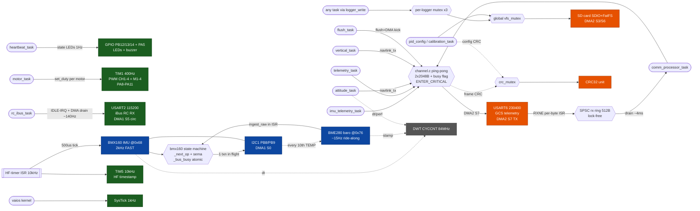

# Vayu FC — Hardware Resource Ownership & Sharing Map

**What this is:** a deep map of every shared hardware resource in the Vayu
flight-controller firmware — UARTs, I2C bus, SPI, GPIO (LEDs/buzzer/sensor
pins), PWM channels, timers, DMA streams, CRC, DWT, and SD/VFS storage — naming
**who owns each, how concurrent access is serialized, and at what rate**.
Generated 2026-06-23 from `src/` + `extern/vaios/extern/NavHAL/` at HEAD.
Target: STM32F401RE (Cortex-M4, 84 MHz). Sibling of
`sitl-fc-stub-inventory.md` (which covers how these edges are stubbed in SITL).

## Ownership philosophy (the rule the whole system follows)

Every peripheral has exactly **one initializing owner**. Three sharing patterns
recur:

1. **Single-owner, exclusive** — one module inits and drives the pin/peripheral;
   nobody else touches it (LEDs, motor pins, each UART's RX or TX side).
2. **Single-owner loop, others ride it** — one driver owns a *bus* and pumps a
   serial state machine; secondary devices are slotted into that loop, never
   driving the bus themselves (I2C: IMU owns it, baro rides it).
3. **Shared peripheral, mutex/critical-section guarded** — one HW unit, multiple
   callers, serialized by a lock or `ENTER_CRITICAL` (CRC unit, VFS, the
   telemetry TX ping-pong buffer).

Read-only HW (DWT cycle counter) needs no coordination — concurrent reads are safe.

## Ownership diagram

Tasks (rounded) → the guard they pass through (diamond/hex) → the peripheral
(rectangle). Edge labels show rate/role. Colour: green = single-owner exclusive,
blue = single-owner loop (others ride), orange = shared+guarded, grey = read-only.



---

## 1. UART / serial ports

Three USARTs exist; two are used. **Note the SITL inversion** (see end).

| UART | Pins | Role (real HW) | Baud | Owner | Direction |
|---|---|---|---|---|---|
| USART1 | PB6/PB7 | unused | — | — | — |
| **USART2** | PA2/PA3 | **iBus RC input** | 115200 | `rc_ibus_task` | RX only |
| **USART6** | PC6/PC7 | **GCS telemetry** | 230400 | `channel.c` / telemetry tasks | TX + RX |

- RC mapping: `src/comm/rc_task.c:109-114` ("iBus on USART2 … Telemetry owns USART6").
- Telemetry mapping: `src/main.c:72` (`.uart = HAL_UART_6`); baud
  `include/vaios_app_config.h:20` (230400, sized for the ESP8266 WiFi relay).

### UART2 (RC) — RX-only, single owner
- Init + DMA-RX by `rc_ibus_task` (`rc_task.c:111-114`): **DMA1 Stream5 Ch4**,
  circular, 128 B buffer (`ibus_dma_buf`).
- Frame boundary via **UART IDLE-line IRQ** → `ibus_idle_isr` gives a binary
  semaphore (`rc_task.c:30-36`); task drains read_ptr→write_ptr using
  `hal_uart_dma_rx_index` (NDTR). No writers → no contention.
- **Rate:** iBus ~ every 7 ms (~140 Hz frame), DMA continuous.

### UART6 (telemetry) — bidirectional, the most-shared port
**TX side — multiple writer tasks, serialized by a ping-pong buffer in `channel.c`:**
- Writers (`imu_telemetry_task`, `comm_processor_task`, `flush_task`, anything
  calling `navlink_tx_*`) append into `g_telemetry_channel` via `write_channel`
  under `ENTER_CRITICAL/EXIT_CRITICAL` (`channel.c:171-186`). Two 2048 B buffers
  (`CHANNEL_TX_BUF_SIZE`, sized for the ~1.3 KB 1 Hz perf burst).
- `flush_task` swaps the active buffer under a critical section, sets a
  `volatile busy` flag, and kicks **DMA2 Stream7 Ch5** (`channel.c:204-235`).
  Overflow → frame dropped + `_tx_overflow_count++` (COMM-CH-002).
- **Why Stream7, not Stream6:** SDIO TX-DMA owns DMA2 Stream6 and re-attaches its
  IRQ on every block write; UART6 uses the alternate Stream7 mapping to avoid the
  IRQ collision that would wedge telemetry `busy` after the first SD write
  (`uart.c:369-377`).
- DMA-complete IRQ → `_dma_complete_callback_u6()` clears `busy`
  (`channel.c:60-67`). Since `hal_uart_write_dma` is synchronous on host, the
  SITL shim fakes this by calling `dma_tx_complete_callback()` inline.

**RX side — GCS→FC commands, lock-free SPSC ring:**
- Per-byte RXNE IRQ → `uart2_packet_recv_callback()` (name is a misnomer; it's
  USART6) pushes into a 512 B raw ring (`serializer.c:5-42`).
- `comm_processor_task` drains it (~every 4 ms) via `navlink_router_poll`.
- Atomicity: single 16-bit head/tail, naturally atomic on Cortex-M4 — no mutex.

**TX↔RX coordination:** fully independent (separate DMA stream, separate buffers,
separate IRQs); the TX `busy` flag never blocks RX.

### Telemetry message rates (content, produced by the real `telemetry_task`)
~500 Hz base tick (`v_delay(TELEM_BASE_MS)`, =2), ms-gated per stream:
ImuCompressed/Attitude/Motor/CONTROL_TRACE 50 Hz · log ~17 Hz · RC ~11 Hz ·
Baro/Vertical 5 Hz · Status ~3.3 Hz · IMU_RAW keyframe ~1.7 Hz · perf/heartbeat ~1 Hz.

---

## 2. I2C bus + sensors — the canonical "single-owner loop"

**One bus: I2C1** (PB8 SCL / PB9 SDA, `variables.h:43-46`). No SPI is used
anywhere (NavHAL has SPI headers; never instantiated).

Devices on I2C1:
- **BMX160 IMU** @ 0x68 (`variables.h:51`) — includes the BMM150 mag via its
  secondary interface.
- **BME280 baro** @ 0x76 (`bme280.h:31`).

### Ownership model: the IMU owns the bus; the baro rides its loop
This is the [[i2c-bus-sharing]] mechanism. At runtime **only the BMX160 driver
drives I2C1**, via a DMA state machine clocked by a 10 kHz timer tick. The baro
is configured **once at boot** (blocking, single-threaded, before the read task
starts) into NORMAL free-running mode at 62.5 ms / 16 Hz (`bme280.c:248-258`),
then is *read* by the IMU loop — it never initiates a transaction itself.

**State machine** (`bmx160.c:71-77`) cycles one-transaction-at-a-time:
```
IMU_OP_FAST (gyro+accel, 2 kHz)
   └─every 13th→ IMU_OP_MAG (~150 Hz)
                     └→ IMU_OP_TEMP (~150 Hz)
                            └─every 10th→ IMU_OP_BARO (~15 Hz)  → back to FAST
```
- The read task waits on a counting semaphore (`bmx160_ready_sema`); each DMA
  completion callback copies the bytes, sets `_next_op`, and gives the semaphore
  (`bmx160.c:867-911`, callbacks `:950-1026`). Baro bytes are ingested via
  `bme280_ingest_raw()` in the callback (`bmx160.c:1016`).
- **Invariant: exactly one I2C transaction is ever in flight.** `_next_op`
  (set by the previous callback) decides the next — so no arbitration is needed.

### Serialization primitives (`i2c_manager.c`)
- `_bus_busy` atomic flag guards both sync and async paths, claimed under a
  critical section (`i2c_manager.c:13,20-28`).
- `_i2c_sema` mutex guards the **blocking** API used only at boot
  (`i2c_manager.c:12`). After boot the bus is exclusively the async loop's.
- DMA: **DMA1 Stream0 Ch1**, P2M from the I2C data register
  (`i2c_manager.c:189-200`); NavHAL owns the stream + its IRQ
  (`i2c.c:128-137`).

### Rates
IMU FAST = **2000 Hz** (`IMU_SAMPLE_FREQ_HZ`, `variables.h:218`), paced by the
HF-timer ISR (`bmx160_fast_tick_isr`, 500 µs). Mag/temp ~150 Hz; baro effective
~15 Hz (matches the BME280 native cadence). Compensation runs off-ISR in task
context on freshness flags.

---

## 3. GPIO — LEDs, buzzer, sensor/actuator pins (all single-owner)

| Pin | Function | Owner | Cite |
|---|---|---|---|
| PB12 | Blue LED | `heartbeat_task` | `heartbeat.c:32` |
| PB13 | Green LED | `heartbeat_task` | `heartbeat.c:33` |
| PB14 | Red LED | `heartbeat_task` | `heartbeat.c:34` |
| PA5 | Buzzer | `heartbeat_task` | `heartbeat.c:35` |
| PA8–PA11 | Motor 1–4 PWM (TIM1 CH1–4, AF1) | `esc_init` (via `motor_task`) | `motor.c:23-26` |
| PB8/PB9 | I2C1 SCL/SDA (open-drain) | `i2c_manager` | `i2c_manager.c:35-36` |
| PA2/PA3 | USART2 RC | `rc_ibus_task` | `rc_task.c` |
| PC6/PC7 | USART6 telemetry | `channel.c` | `main.c` |

**The status/indicator owner is `heartbeat_task`** (`heartbeat.c:153`): a state
machine that maps `system_state` (INIT/STANDBY/PREARM/ARMED/IN_AIR/FAILSAFE/
TERMINATED/CALIBRATING) to the 3 LEDs + buzzer, default 1000 ms period
(`variables.h:37`). Every GPIO is initialized exactly once by its module — no
shared/multi-owner pins. (In SITL all GPIO is no-op'd, §8 of the stub inventory.)

---

## 4. PWM channels — shared timer, per-channel duty

- **TIM1** (APB2, 84 MHz) drives **all four motor channels** (CH1–CH4).
- 400 Hz period (2.5 ms), 1.0–2.0 ms pulse band = duty 0.4–0.8
  (`esc.c:12-14,42,70`).
- Ownership is **distributed over one shared timer**: the first `esc_init`
  configures TIM1; subsequent ESC inits reuse it (`esc.c:17-44`, `motor.c:23-26`).
  `motor_task` is the sole runtime writer, setting each channel's duty via
  `hal_pwm_set_duty_cycle(&esc->pwm, duty)` (`motor.c:62-65`) — one peripheral,
  four channels, one writer task, so no locking needed.
- **Rate:** motor_task updates duties each control iteration (the rate loop).
  In SITL this becomes a 4-float snapshot frame to the PWM FIFO per call.

---

## 5. Timers & other core peripherals

| Resource | Freq | Purpose | Owner | Sharing | Cite |
|---|---|---|---|---|---|
| **TIM1** | 400 Hz | motor PWM ×4 | `esc_init`/`motor_task` | shared timer, per-channel duty | `motor.c:23-26` |
| **TIM5** | 10 kHz | HF-timer ISR / timestamp | `timer_callback_init` | up to 4 registered callbacks | `timer_callbacks.c:17,44` |
| **SysTick** | 1 kHz | kernel tick / task delays | vaios kernel | exclusive | `main.c:150` |
| **DWT CYCCNT** | 84 MHz | inter-sample dt timestamp | `hal_cycle_counter_init` | **read-only, many readers** | `main.c:146` |
| **CRC unit** | — | packet/config CRC32 | `utils_*_compute_crc32` | **`crc_mutex`-guarded** | `sys_utils.c:105-137` |
| RNG | — | not used | — | — | — |

- The **10 kHz HF timer** (TIM5) increments the 64-bit `_time_stamp_high_freq`
  (`sys_utils.c:16`); `increment_high_freq_timer` is registered at
  `IMU_FAST_PERIOD_US` granularity (`main.c:116`). It paces the IMU FAST tick and
  stamps every outgoing telemetry packet. In SITL it's driven off the virtual
  clock by the IMU feeder instead of a real ISR.
- **DWT** is read by `bmx160` (`:1149`), `bme280` (`:196`), and `attitude_task`
  (`:76,122,135`) for true dt and perf cost — safe because reads have no side
  effects (32-bit, wraps ~51 s; firmware diffs handle wrap).
- **CRC** is the one shared compute peripheral with real contention: a lazily
  created `crc_mutex` serializes init+compute so concurrent callers (telemetry
  framing, PID-config CRC) don't corrupt each other (`sys_utils.c:105`).

---

## 6. VFS / SD-card storage

**Backend:** SD card over **SDIO + FatFS**.
- SDIO driver `extern/.../stm32/sdio/sdio.c` (21 MHz, 1/4-bit); block layer
  `diskio.c`; FatFS wrapper `extern/.../utils/v_fs.c` (max 4 open files,
  preallocates to avoid FAT-chain fragmentation); core FatFS `ff.c`.
- VFS API (`extern/vaios/include/vfs.h`): `vfs_open/close/read/write/lseek/sync/
  mkdir/unlink/preallocate/size`. Real impl `extern/vaios/kernel/vfs.c`.

### File inventory (all on drive `0:`)
| File | Owner module | Purpose | Prealloc |
|---|---|---|---|
| `0:pid.bin` | `pid_config.c:24` | PID gains (rate+angle) | 1 KB |
| `0:cal.bin` | `bmx160.c:188,1919` | IMU calib (offsets, soft-iron, gyro LPF) | 1 KB |
| `0:v_nav.bin` | `logger.c` | navlink blackbox (circular) | 10 MB |
| `0:v_sys.bin` | `logger.c` | system log (circular) | 10 MB |
| `0:v_gen.bin` | `logger.c` | general log (circular) | 10 MB |

### Serialization — two layers (no dedicated storage task)
1. **Global VFS mutex** (`vfs.c:5`, `vfs_lock`/`vfs_unlock`): every
   open/close/read/write/lseek/sync/mkdir/unlink is serialized. This single lock
   is the system-wide storage gate (the potential bottleneck under heavy logging).
2. **Per-logger mutexes** (`logger.c:34-36`): `navlink/system/general` each guard
   their own write-position+seek+write+sync sequence.
- **Lock order** (deadlock-safe): logger mutex first, then the VFS mutex acquired
  inside `vfs_*`.
- Writes happen **inline from the caller's task context**, not a storage task:
  PID save from `comm_processor_task` (or boot), calib save from
  `calibration_task`, logging from any task via `logger_write()`. Each save
  ends with `vfs_sync()`.

### Timing
- **Boot (scheduler stopped):** `v_system_init` mounts FatFS → `logger_init`
  preallocs+opens the 3 logs → `pid_config_init` reads `0:pid.bin` →
  `bmx160_init` reads `0:cal.bin` → `scheduler_start` (`main.c:136-164`). This is
  why config reads need no locking: single-threaded before tasks run.
- **Runtime:** PID/calib persisted on command; logs written continuously during
  flight.
- **DMA:** optional `_SDIO_BACKEND_DMA` uses DMA2 Stream3 (RX) / **Stream6 (TX)**
  — the stream UART6 deliberately avoids (§1). Owned entirely by the SDIO driver,
  abstracted from the app.

---

## 7. DMA stream allocation (the contended fabric)

| Stream | User | Direction | Note |
|---|---|---|---|
| DMA1 Stream0 Ch1 | I2C1 (sensors) | P2M | IMU/baro reads |
| DMA1 Stream5 Ch4 | USART2 RX (RC) | P2M, circular | iBus |
| DMA1 Stream6 Ch4 | USART2 TX | M2P | only if `_UART_BACKEND_DMA` |
| DMA2 Stream3 | SDIO RX | P2M | if `_SDIO_BACKEND_DMA` |
| DMA2 Stream6 | SDIO TX | M2P | re-attaches IRQ per block write |
| **DMA2 Stream7 Ch5** | **USART6 TX (telemetry)** | M2P | chosen to dodge SDIO's Stream6 |

The Stream6/Stream7 split is the one place two subsystems nearly collided; it's
resolved by static stream assignment, not runtime arbitration.

---

## 8. Potential contention points

Ranked by likelihood × impact. Each notes the mechanism, whether it's already
mitigated, and verification status.

### C1 — Command save stalls the RX drain → lost GCS commands *(real, cross-resource)*
The hottest chain. `comm_processor_task` both (a) drains the 512 B UART6 RX ring
and (b) handles `CMD_SET_PID` / `CMD_SET_GYRO_LPF`, which call `pid_config_save()`
→ `vfs_open/write/sync/close` — **synchronous SD I/O under the global VFS mutex,
in the task's own context** (`comm_processor.c:127-132` → `pid_config.c:94-104`).
While that save blocks on SD-block latency (+ contends the VFS mutex against
logging), the RX ring is not being drained. At 230400 baud the 512 B ring holds
only ~22 ms of input, so a slow save can overflow it and silently drop inbound
commands. **Mitigation:** none today. *Confirmed by code.* Fix options: move
persistence to a dedicated low-prio storage task, or drain RX before the blocking
save.

### C2 — Telemetry TX buffer overflow vs UART6 bandwidth *(real, by-design-capped)*
Many writers (`imu_telemetry`, `telemetry_task`, `comm_processor`, `attitude`,
`vertical`, `flush`) funnel into one 2×2048 B ping-pong buffer. UART6 at 230400
baud ≈ 22.5 KiB/s. The 1 Hz perf burst is ~1336 B back-to-back and the buffer was
*sized up from 512 B specifically because that burst overflowed* (`channel.c:9-14`).
If aggregate telemetry exceeds link bandwidth, frames are dropped and
`_tx_overflow_count++` (COMM-CH-002, `channel.c:177`). **Mitigation:** oversized
buffer + drop-and-count (no corruption, observable in health). *Confirmed.*
Residual risk: sustained over-subscription silently thins telemetry.

### C3 — Global VFS mutex serializes all storage *(real, latent bottleneck)*
One `vfs_mutex` (`vfs.c:5`) gates every op across 3 circular loggers + PID +
calib. Each logger write does seek+write+**sync** (`logger.c`), and writes run
inline from caller task context (no storage task). Under continuous flight
logging, a `pid_config_save` from C1 can queue behind logger I/O, compounding the
stall. **Mitigation:** per-logger mutexes reduce *intra-logger* contention but
not the global gate. *Confirmed.* This is the structural cause behind C1's
latency.

### C4 — IMU FAST tick vs in-flight bus transaction *(bounded, safe)*
The 10 kHz HF-timer releases the FAST read via a **binary** semaphore that
*coalesces* — "ticks that arrive while the task is mid-cycle cap, never queue"
(`bmx160.c:1035-1042`). So when a longer MAG/TEMP/BARO transaction (or a slow
2 kHz cycle, measured ~237 µs) delays the loop, FAST samples are *skipped/merged*,
not corrupted — the IMU rate dips, dt stays honest (DWT-stamped). **Mitigation:**
coalescing by design; single-txn-in-flight invariant. *Confirmed safe*, but means
effective IMU ODR is load-dependent, not a hard 2 kHz.

### C5 — Blocking I2C API used after the async loop starts *(invariant, must hold)*
Post-boot the bus is exclusively the BMX160 async DMA loop. The blocking
`i2c_manager` path (`_i2c_sema` mutex + `_bus_busy` acquire,
`i2c_manager.c:20-28`) is intended for **boot-time single-threaded init only**. If
any runtime path (e.g. a re-run calibration issuing blocking reads) takes
`_bus_busy` while FAST DMA is mid-transaction, they contend on the same bus. The
atomic `_bus_busy` guard prevents *corruption* (acquire fails → caller must back
off) but a careless caller could stall or starve the FAST loop. **Mitigation:**
atomic acquire; relies on the "blocking = boot only" discipline being preserved.
*Design invariant — audit any new runtime I2C caller.*

### C6 — CRC unit shared on the telemetry hot path *(minor)*
One HW CRC unit, `crc_mutex`-guarded (`sys_utils.c:105`), used by telemetry frame
checksums (per emitted frame on the ~500 Hz telemetry loop) and config CRC. A config save briefly blocks framing.
**Mitigation:** mutex; contention window tiny. *Low impact.*

### C7 — DWT 32-bit wrap (~51 s) *(correctness, not a lock)*
`dt = (now − prev)/84e6` from a 32-bit counter wrapping every ~51 s. A reader
whose `prev` is stale by >51 s (severe starvation, or first-sample) computes a
garbage dt → attitude spike. Firmware anchors the first sample; SITL anchors the
counter at process start (stub-inventory §7). **Mitigation:** first-sample guards;
unsigned-diff wrap math. *Watch any new long-gap DWT reader.*

### C8 — DMA2 Stream6/7 (resolved, do not regress)
UART6 TX deliberately uses **DMA2 Stream7** because SDIO TX owns **Stream6** and
re-attaches its IRQ per block write; sharing it would wedge telemetry `busy`
after the first SD write (`uart.c:369-377`). *Resolved by static assignment* —
flagged so future DMA additions keep clear of S6/S7.

**Summary:** the genuine, unmitigated risk is the **C1→C3 chain** (synchronous
persistence on the comm task under a global storage lock, starving inbound
commands). Everything else is either capped-by-design (C2, C4), guarded (C5, C6),
a correctness edge (C7), or already resolved (C8).

---

## 9. SITL divergences (important caveats)

The host shims (`sim/host/`, see `sitl-fc-stub-inventory.md`) change some
ownership:

- **UART roles invert.** Real HW: telemetry=UART6, RC=UART2. SITL:
  telemetry is emitted on **HAL_UART_2** (host pty, `host_lifecycle.c`) and RC is
  injected via the **queue bypass** (`host_rc_feeder` → `rc_queue`), so UART6 +
  the iBus DMA path are not exercised. The earlier stub-inventory's "UART2 =
  telemetry" is true *in SITL only*.
- **I2C bus is gone.** `i2c_manager_*` are no-op stubs; the baro is driven by
  `bme280_publish()` from the baro FIFO and the IMU by raw frames from the IMU
  FIFO — the single-owner loop is replaced by two feeder threads.
- **GPIO/timers/CRC:** GPIO no-op'd; HF timer + DWT come off the virtual clock;
  CRC reimplemented in software (STM32 variant) so packets pass the GCS gate.
- **VFS:** SDIO/FatFS replaced by a disk-backed `/tmp/vayu_vfs` table; the global
  VFS mutex behavior is not modeled (host is effectively single-writer).

## References
- Comm: `src/comm/{channel,serializer,comm_processor,telemetry_task,rc_task}.c`,
  `extern/.../stm32/uart/uart.c`
- Sensors/bus: `src/sensor/{i2c_manager,bmx160,bme280}.c`, `extern/.../stm32/i2c/i2c.c`
- Actuator/GPIO: `src/actuator/{esc,motor}.c`, `src/sys/{heartbeat,timer_callbacks,sys_utils}.c`
- Storage: `extern/vaios/kernel/vfs.c`, `extern/.../utils/v_fs.c`, `extern/.../stm32/sdio/`,
  `src/control/pid_config.c`, `src/logger/logger.c`
- Memory: [[i2c-bus-sharing]] · Sibling: `firmware/docs/scratch/sitl-fc-stub-inventory.md`
