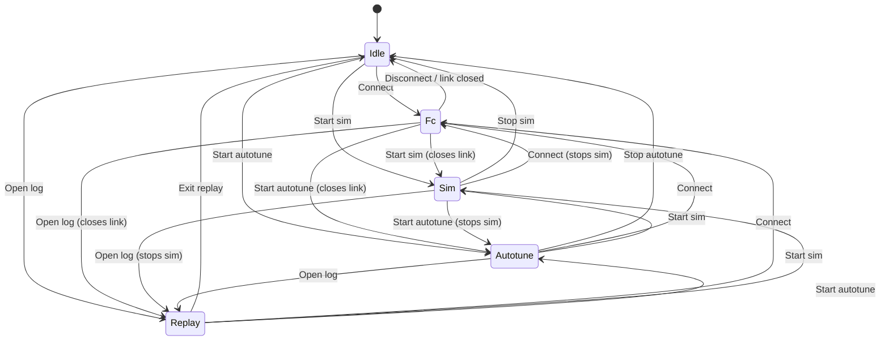

# GCS telemetry-source state machine

Status: ✅ shipped — the `SourceController` FSM (`src/core/SourceController.{h,cpp}`,
`SourceState.h`, sim source at `src/comm/SimSource.h`) is the live single-owner of
telemetry-source state; the old scattered flags and the 2-state `SessionState`/
`SessionMode` are gone. Completed **Phase C** of the telemetry-engine refactor (unify
sources behind one `engine.setSource()`), building on the `ITelemetrySource` seam from
[`gcs-log-replay.md`](gcs-log-replay.md). The body below remains as design rationale.

## Context

The GCS has three runnable telemetry sources plus the state it boots in:

1. **FC** — the live serial/UDP link.
2. **Sim** — the in-app SITL (interactive), with **Autotune** as a separate isolated
   run (its own firmware + `vsim_d`, viz-only, does not feed the GCS engine).
3. **Replay** — a recorded `.bin` played through the parser.
4. **Idle** — the null state at startup, no source active.

Today these are tracked by *scattered orthogonal flags* (`m_connected`,
`m_simRunning`, `m_serialOpen`/`m_udpOpen`, `m_replaySource`) plus a minimal
2-state `SessionState {Live, Replay}` (`src/core/SessionMode.h`). Problems:

- **No true mutual exclusion.** Sim and a live FC link can both feed the parser at
  once — the sim's bytes go straight to `TelemetryEngine::feedBytes`
  (`MainWindow.cpp:274`), and only replay actually mutes the live feed (via
  `m_acceptLive`). Last frame wins; the two streams interleave.
- Source semantics — tx-allowed, UI lockouts, status pill, recording — are derived
  ad-hoc from flag combinations across ~10 sites in `MainWindow.cpp`.
- No first-class "no source": the app starts in `Live` with no link.

## Goal

Promote `SessionState` into a single **`SourceController`** finite state machine that
owns *which source is active*, enforces **exactly one feed at a time** (or none in
Idle), and drives all gating from one `stateChanged` signal. Make **Sim** a
first-class `ITelemetrySource` so every non-live source flows through the same
`engine.setSource()` seam.

Decisions: **five peer states** (Idle/FC/Sim/Autotune/Replay); **strict single
active source** (entering a state tears down the previous); **full source
unification**.

## State machine



### States

| State      | Active `ITelemetrySource` | Engine feed                | tx-allowed | Pill         | Recording |
| :--------- | :------------------------ | :------------------------- | :--------- | :----------- | :-------- |
| `Idle`     | none                      | none                       | no         | Disconnected | no        |
| `Fc`       | none (engine-internal)    | live (`setLiveFeed(true)`) | **yes**    | port label   | yes       |
| `Sim`      | `SimSource`               | sim bytes via seam         | **yes**¹   | "SIM"        | yes       |
| `Autotune` | none (tuner isolated)     | none                       | no²        | "AUTOTUNE"   | no        |
| `Replay`   | `ReplaySource`            | replay bytes via seam      | no         | "REPLAY"     | no        |

¹ tx is policy-allowed in Sim (matches today — `sendToFc` only blocks replay) but
physically inert unless a transport is open. ² Applying tuned gains needs a real
link: the operator transitions Autotune→Fc, then clicks Apply; Autotune never opens
a link silently. `txAllowed()` is true only in `{Fc, Sim}`.

### Transitions

Every non-trivial transition is **teardown the current source, then set up the new
one** — centralized in the controller so no caller juggles the matrix. Teardown
reuses existing functions and must be idempotent (all already guard on null):

| Source     | Teardown                                                    |
| :--------- | :--------------------------------------------------------- |
| `Fc`       | PortArbiter release + `closeLinks` (queued) + `stopRecording` |
| `Sim`      | `SimulatorWidget::stopInAppSim()` (firmware persists — one-shot) |
| `Autotune` | `SimulatorWidget::stopAutotune()` + thread joins           |
| `Replay`   | pause + detach + delete `ReplaySource`, hide bar           |

then `setEngineSource(active)` with the new source (`ReplaySource`/`SimSource`/`nullptr`).

**Link-loss nuance:** a stale heartbeat **stays `Fc`** (pill shows disconnected,
auto-reconnect may recover); only an actual transport close
(`connectionStateChanged(false)` with both transports down) triggers `forceIdle()`.

## Architecture

### `SourceController` — `src/core/SourceController.{h,cpp}` (new)

Replaces `SessionState`. Minimal Qt (QObject + signals), **no engine/widget deps** —
collaborators are injected as `std::function` hooks, so the FSM is unit-testable
headless with spies.

```cpp
enum class SourceState { Idle, Fc, Sim, Autotune, Replay };   // SourceState.h, Q_DECLARE_METATYPE

class SourceController : public QObject {
  Q_OBJECT
public:
  SourceState state() const;  SourceState previous() const;
  bool txAllowed() const;     // Fc || Sim
  bool isReplay() const;      // == Replay
  bool feedActive() const;    // Fc || Sim || Replay
  ITelemetrySource* activeSource() const;

  struct Hooks {              // each lambda calls EXISTING MainWindow/engine code
    std::function<void()> teardownFc, teardownSim, teardownAutotune, teardownReplay;
    std::function<bool(const QString&,int)> setupFc;
    std::function<bool()> setupSim, setupAutotune;
    std::function<bool(const QString&)> setupReplay;
    std::function<void(ITelemetrySource*)> setEngineSource;
  };
  void setHooks(Hooks);

public slots:
  bool requestIdle();  bool requestFc(const QString&,int);  bool requestSim();
  bool requestAutotune();  bool requestReplay(const QString&);
  void forceIdle();                       // demote on link loss / source death
signals:
  void stateChanged(SourceState now, SourceState prev);
};
```

Core `transition(to, setup)`: run current state's teardown → run setup (on failure
land in `Idle`) → update `m_prev/m_state/m_active` → `setEngineSource(m_active)` →
`emit stateChanged`. The active source is held **non-owning** (lifetime stays with
MainWindow/SimulatorWidget). The firmware one-shot constraint is documented in the header.

### Engine seam — `TelemetryEngine`

Add two queued slots; **retire `setReplayMode`** (2 call sites) and the bare
`m_acceptLive` mechanism:

```cpp
void setSource(ITelemetrySource* s);  // disconnect old, connect new (auto-queued GUI→worker)
void setLiveFeed(bool on);            // m_liveFeedWanted; m_acceptLive = on && !m_source
```

- `Fc`: `setSource(nullptr)` + `setLiveFeed(true)` — transports feed internally via
  `onLiveBytes`. No `LiveSource` object is resurrected (it is **vestigial** — only a
  comment in `ITelemetrySource.h` references it; an object would just bounce
  worker-thread bytes cross-thread for nothing).
- `Replay`/`Sim`: `setSource(replaySource | simSource)` + `setLiveFeed(false)`.
- `Idle`/`Autotune`: `setSource(nullptr)` + `setLiveFeed(false)`.

`m_acceptLive` becomes derived (`(m_source==nullptr) && m_liveFeedWanted`).

### `SimSource` — `src/comm/SimSource.{h,cpp}` (new)

A trivial `ITelemetrySource` relay. Replace the direct wire at `MainWindow.cpp:274`
(`SimulatorWidget::dataReceived → feedBytes`) with `dataReceived →
SimSource::bytesReceived`, routed via `engine.setSource(m_simSource)`. This makes Sim
mutable like replay — a net safety win, since stale one-shot-firmware heartbeats can't
reach the parser once Sim is torn down. Autotune remains a **no-source** state
(isolated tuner, viz-only `m_tuneSim`).

### MainWindow refactor

- Replace `SessionState m_session` with `SourceController m_source`; build + inject
  `Hooks` at construction (lambdas wrapping `startInAppSim`/`stopInAppSim`/
  `startAutotune`/`stopAutotune`, the openSerial/bindUdp block, ReplaySource
  create/destroy, and queued `setSource`/`setLiveFeed`).
- Delete `m_connected`/`m_simRunning` (query the FSM); keep
  `m_serialOpen`/`m_udpOpen`/`m_currentPort`/`m_recordingPath` as transport bookkeeping.
- Rewrite in FSM terms: `onConnectRequested` (`:773`, drop the replay refusal →
  `requestFc`), `onDisconnectRequested → requestIdle`, `enterReplay`/`exitReplay`
  (`:825-876`) become the replay setup/teardown hooks (exit → `requestIdle`), sim
  Start/Stop drive the FSM (public slots or request-signals; `:304-313`),
  `refreshConnectionPill` (`:1304`, switch on state), `feedActive` (`:1346`),
  `updateLiveBlinker` (`:1448`, only in `Fc`), `updateExportEnabled` (`:1196`),
  link-loss watchdog (`:1464`), and the **single tx guard** `sendToFc` (`:882` →
  `!m_source.txAllowed()`). Apply-gains keeps its `state()==Fc` guard (`:281`). One
  new `stateChanged` handler replaces the `m_session.changed` lambda (`:90`) and
  centralizes toolbar read-only + serial-controls-enabled + pill + export.
- Strict exclusion is automatic — the controller runs the old state's teardown before
  the new setup (e.g. Sim→Fc stops the sim *and* PortArbiter revokes the RC bridge).
  `forceIdle()` from `closeEvent` before the worker stops.

## Tests

- Replace `tst_session_state.cpp` with **`tests/tst_source_controller.cpp`**: drive
  the controller with spy `Hooks` (record call order; configurable setup success).
  Cover: default = Idle; `txAllowed` true only in Fc/Sim; `stateChanged` fires once
  per real transition; **full transition matrix** (teardown-of-`from` before
  setup-of-`to`; `activeSource()` gets the right pointer); setup-failure → Idle;
  `forceIdle()` from every state. Uses a fake `ITelemetrySource` — no engine/widget.
- Remove `LiveSource.{h,cpp}` + `tst_live_source` (vestigial; role now `setLiveFeed`).
- CMake (`software/CMakeLists.txt`, `software/tests/CMakeLists.txt` — hand-maintained):
  add `SourceController.cpp`/`SourceState.h`/`SimSource.{h,cpp}` and the new test
  (drop `tst_session_state`, `tst_live_source`), mirroring the `navigator_test` helper.
  Build `cmake --build build`; run `ctest --test-dir build/tests -R tst_source_controller`.

## Risks / edge cases

- **Firmware one-shot:** `vayu_sitl_start` runs once per process; only `vsim_d` cycles
  on Sim re-entry. Teardown relies on `stopInAppSim`'s UART-callback detach; the
  controller's `setSource(nullptr)` is the extra guarantee.
- **PortArbiter:** unchanged last-acquire-wins; acquire/release stay in the Fc hook.
- **App exit:** `forceIdle()` first (joins autotune threads via the existing
  destructor backstop) before stopping the engine worker.
- **Async open race:** `requestFc` is optimistic; `linkOpened(false) → forceIdle()` +
  release; the pill distinguishes via `m_serialOpen||m_udpOpen`.

## Rollout (SITL-first) — completed

The rollout below shipped in this order; retained as the as-built sequence.

1. **Engine seam, no behavior change:** add `setSource`/`setLiveFeed`, migrate replay
   enter/exit onto them; `tst_replay_*` stay green.
2. **Controller + SimSource + headless test:** `ctest -R tst_source_controller` green;
   not yet wired.
3. **MainWindow migration:** swap flags for FSM queries, drive sim/autotune through
   it, remove `SessionState`/`LiveSource`. Verify in SITL (headless,
   `QT_QPA_PLATFORM=offscreen` / Xvfb `:99`): Idle→Sim→Idle→Sim (one-shot re-entry),
   Sim→Fc, Fc→Replay (tx blocked), Replay→Idle, Idle→Autotune→Fc apply-gains; assert
   exactly one pill + one feed at a time.
4. **Hardware:** real-board connect/disconnect, Sim→Fc PortArbiter revoke,
   link-loss-stays-Fc vs transport-close→Idle, apply tuned gains over the live link.

## Changelog

| Date       | Author          | Description                          |
| ---------- | --------------- | ------------------------------------ |
| 15/06/2026 | ragnar-vallhala | Initial design & implementation plan |
