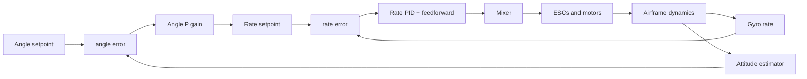
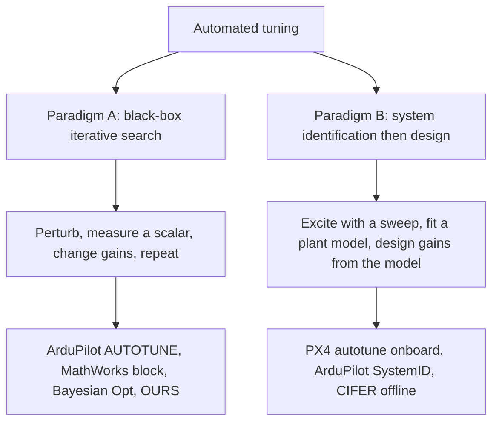
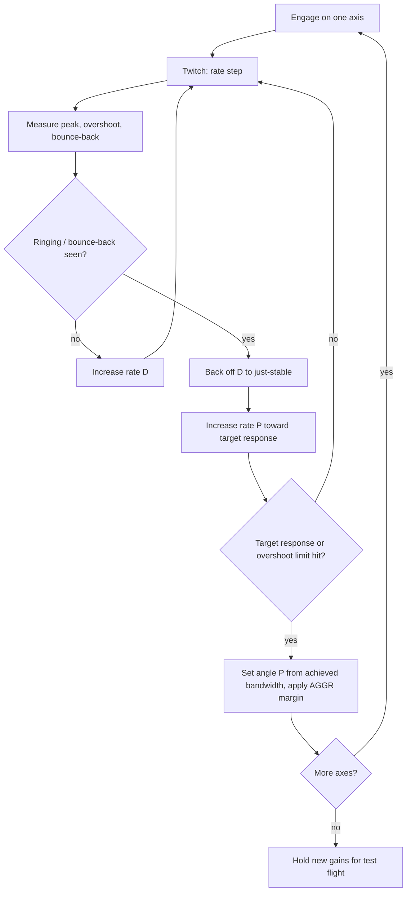
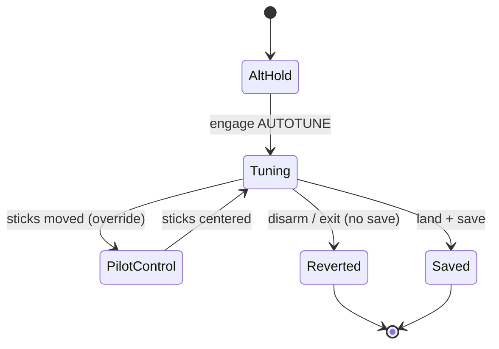
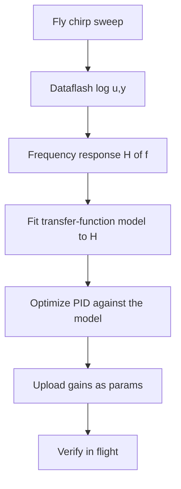
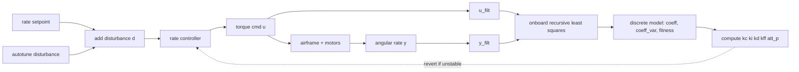
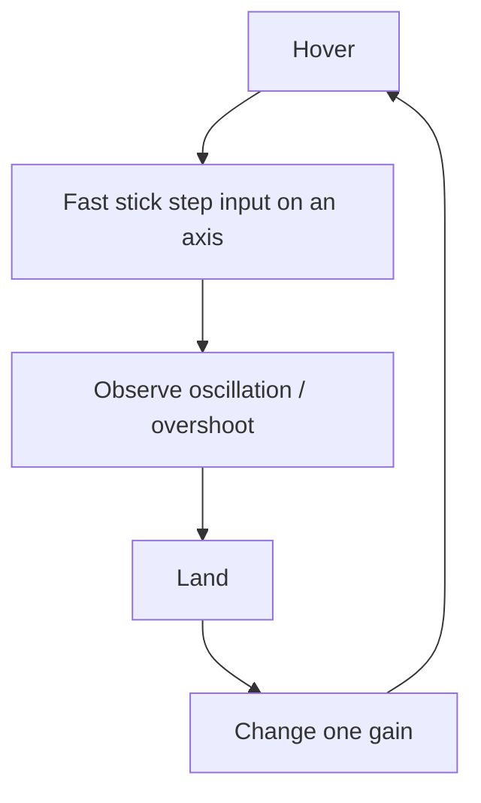
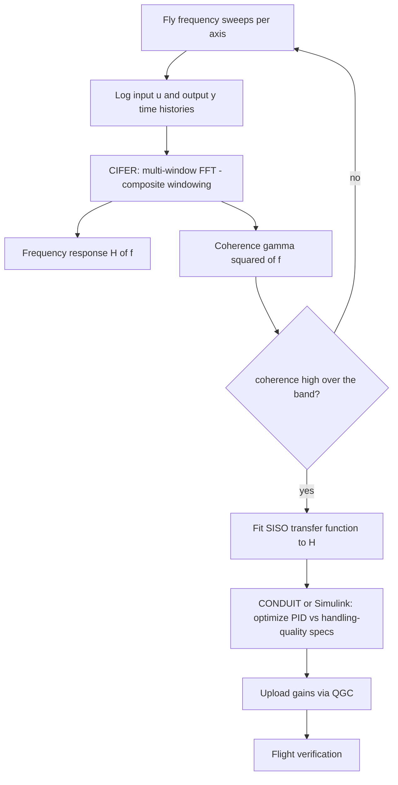
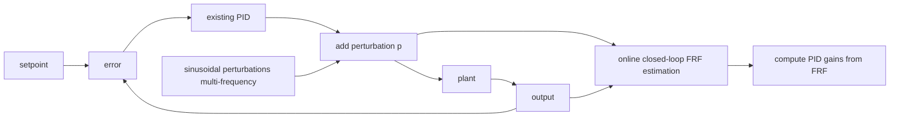
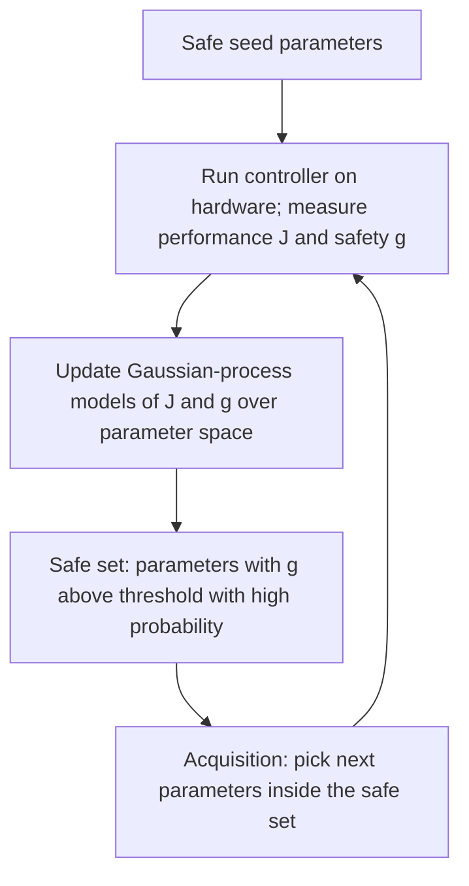

# Prior-art deep dive: how each multirotor autotuner actually works

Companion to [gcs-live-rig-tuning.md](gcs-live-rig-tuning.md) and the at-a-glance
[prior-art summary](gcs-live-rig-tuning-prior-art.md). This is the **from-core**
version: the control-theory background, then each system's **setup, control
mechanics, algorithm, safety, correctness, and communication** with diagrams, so
you can build your own rather than recite headlines.

> Architecture facts are source-cited + verified (see the study). Inner algorithm
> details (model order, RLS, exact search rules) are established but
> **version-specific** — confirm against current source before copying constants.
> Diagrams are conceptual, not byte-exact.

---

## 0. Background you need first: the cascaded attitude controller

Every tuner below tunes pieces of the **same structure** — a multirotor attitude
controller is a *cascade* of two nested loops:



- **Inner loop = rate (angular-velocity) PID.** Fastest, runs at the gyro/loop
  rate (hundreds of Hz–kHz). Kp/Ki/Kd (+ feedforward, + a gyro low-pass). This is
  what dominates "feel" and where instability/oscillation lives.
- **Outer loop = angle (attitude) P.** Converts an angle error into a rate
  setpoint for the inner loop. Usually just a P term.
- **Why "tune rate first, then angle":** the outer loop assumes the inner loop is
  well-behaved. Tune the inner rate loop, *then* close the angle loop around it.
- **Two flight modes use different slices:** *acro/rate* mode commands rates
  directly (only the inner loop is active); *stabilize/angle* mode wraps the angle
  loop on top. So a tuner targets the **rate loop** (works in both) and the
  **angle P** (angle mode only) — which is why we tune per-mode.

**What "tuning" means physically:** find Kp/Ki/Kd/(Kff, LPF) so a commanded change
is tracked *fast* (high bandwidth) but *without* sustained oscillation, overshoot,
or motor "chatter" (high-frequency D-noise amplification). Every system below is a
different way to search that trade-off.

**Two paradigms.** Everything splits into:



---

## 1. ArduCopter AUTOTUNE — onboard iterative "twitch" search (Paradigm A)

Source: <https://ardupilot.org/copter/docs/autotune.html>

### Setup
Fly to a safe altitude in **AltHold/Loiter** in calm air with open space. Flip an
RC aux switch (or mode) to **AUTOTUNE**, then **hold position and keep a hand on
the sticks**. Params: `AUTOTUNE_AXES` (which axes), `AUTOTUNE_AGGR` (≈0.05–0.10,
target aggressiveness/overshoot trade). The vehicle does the work; you babysit.

### Control mechanics — where the excitation goes
A short **commanded rate step ("twitch")** is injected into the **rate-loop
setpoint** of the axis under test; the FC then watches the gyro response. The
craft visibly jerks on that axis and drifts; AUTOTUNE re-centers between twitches.

```
 rate setpoint              gyro response (what AUTOTUNE measures)
   ┌─────┐                      peak
   │     │                       /\        overshoot
 ──┘     └────            ______/  \__              too much D -> "bounce-back"
   twitch step           /          \  /\___        ringing after the peak
                        /            \/
```

### Algorithm — a bracketing search per axis (no model)
*(general / version-specific)* For each axis it walks the rate-loop gains by
trial twitches, reading three features of each response: **peak rate, overshoot,
and bounce-back/ringing**:



Intuition: **D is raised until the response just starts to ring, then backed
off** (D damps but amplifies noise — you want the most damping before chatter);
**P is raised until the target speed of response**; **angle-P** is derived from
the resulting inner-loop bandwidth, scaled by `AUTOTUNE_AGGR` for margin.

### Safety
- Original gains are preserved; **moving the sticks instantly hands control back**
  to the pilot.
- Disarm or leaving the mode **reverts to the pre-tune gains** unless the operator
  explicitly **saves** (typically land + low throttle, or a switch).
- Self-aborts if attitude error grows too large.



### Correctness
No model, no metric file — convergence is to a **target rate-response shape** per
axis; the real acceptance test is the **operator's post-tune flight** (they
choose to save). Cheap and robust, but opaque (you don't get a plant model).

### Communication
Self-contained on the FC. The GCS (Mission Planner/QGC) only sets parameters
(MAVLink `PARAM_SET`) and the operator engages the mode via RC. Results = updated
PID params persisted on the FC.

### What to lift for ours
The **twitch + bounded per-axis feature extraction** (peak/overshoot/ring) is the
direct ancestor of our doublet rollout and cost. We move the *search* off the FC
onto the GCS, and replace "save on landing" with "explicit GCS Apply." Their
**stick-override abort → our operator gesture.**

---

## 2. ArduCopter SystemID — onboard chirp + offline model/PID design (Paradigm B)

Sources: <https://ardupilot.org/copter/docs/systemid-model-development.html>,
<https://ardupilot.org/copter/docs/common-systemid-mode-operation.html>

### Setup
A dedicated **`SystemID` flight mode**. Hover stably, trigger a sweep on one axis,
land, pull the logs, do the analysis on a PC. Repeat per axis.

### Control mechanics — chirp superimposed on the mixer
A **linear/exponential frequency sweep (chirp)** is **added onto the mixer input**
of the chosen axis via `SID_AXIS` (10 roll / 11 pitch / 12 yaw) — "direct input to
the regarded system." Generated onboard (`chirp_input.init()/update()`,
`actuator_roll_sysid()` in `mode_systemid.cpp`).

```
chirp: frequency ramps low -> high over the sweep
amp ┐  /\    /\   /\  /\ /\/\/\︿︿  (period shrinks as f rises)
    │ /  \  /  \  / \ / \/
 ───┼/────\/────\/───\/──────────────► time
    │
```


### Algorithm — two clean offline stages
1. **Identify:** transform logged `u(t)`,`y(t)` to the **frequency domain**; fit a
   plant **transfer function** whose parameters are **optimized to best match the
   measured frequency response** (a Bode magnitude/phase fit).
2. **Design:** use the identified model to **optimize the PID** in a separate step.



### Safety / correctness / communication
Short bounded sweeps in a stable hover, pilot override available. Correctness =
**goodness-of-fit** of the model to the measured FRF, then flight verification.
Onboard logging → offline tools → params back via MAVLink. **GPLv3.**

### What to lift
Proof that **FC-side chirp injected at the mixer/setpoint axis** is a sound
excitation point — exactly our "override the axis setpoint." The **identify-then-
design** split is the alternative we *didn't* take (we score directly), but the
injection mechanics port over verbatim.

---

## 3. PX4 `mc_autotune` — fully onboard sys-ID + gain calc (Paradigm B, in-flight)

Sources: <https://docs.px4.io/main/en/config/autotune_mc>,
<https://docs.px4.io/main/en/msg_docs/AutotuneAttitudeControlStatus>

### Setup
Vehicle must be **flying in an altitude-stabilized mode** (it stays airborne and
hands-off). Operator triggers autotune from **QGroundControl**; it runs the whole
thing onboard.

### Control mechanics — disturbance injection + filtered I/O capture
The flight stack **applies a small disturbance to each axis** (a normalized
torque/rate-setpoint perturbation — effectively a doublet), and records two
filtered signals that the identifier consumes:
- `u_filt` — filtered normalized **torque setpoint** (the input the FC commands),
- `y_filt` — filtered **angular velocity** (the output the airframe produces).



### Algorithm — onboard ARX identification by RLS, then analytic gains
*(model order/RLS are general + version-specific)*
1. **Identify** a low-order discrete **SISO ARX model** (≈ **2-pole/2-zero**)
   relating `u→y`, updated **sample-by-sample with Recursive Least Squares (RLS)**.
   Conceptually it estimates parameters θ in:

   `y[k] = -a1 y[k-1] - a2 y[k-2] + b1 u[k-1] + b2 u[k-2]`

   RLS keeps a running estimate `θ̂` and a covariance that shrinks as evidence
   accumulates — the message exposes `coeff` (the a/b), `coeff_var` (confidence),
   and a **fitness** (how well the model predicts y).
2. **Design:** from the identified model, compute the controller gains
   `kc, ki, kd, kff, att_p` analytically (place the closed loop for a target
   crossover/phase-margin).
3. **Sequence:** **roll → pitch → yaw**, one axis at a time.

```mermaid
sequenceDiagram
  participant QGC as QGroundControl
  participant FC as Flight controller
  QGC->>FC: start autotune (MAVLink)
  loop each axis roll, pitch, yaw
    FC->>FC: inject disturbance; collect u_filt, y_filt
    FC->>FC: RLS -> ARX model (coeff, coeff_var, fitness)
    FC->>FC: compute gains; apply; revert if unstable
    FC-->>QGC: AutotuneAttitudeControlStatus (status, coeff, fitness, gains)
  end
  FC-->>QGC: complete
  Note over QGC,FC: operator test-flies, then saves
```

### Safety
Small disturbance amplitude; **unstable identified gains are reverted in real
time onboard**; requires the altitude-hold envelope; operator aborts by switching
mode. The altitude controller keeps it flying throughout.

### Correctness
The onboard **fitness** + coefficient **variance** gate whether the identified
model (and thus the gains) is trustworthy; final acceptance is a verification
flight.

### Communication
Triggered + monitored over **MAVLink** (the `AutotuneAttitudeControlStatus` uORB
topic bridged to MAVLink); gains written to FC params. **BSD-3.**

### What to lift (most relevant precedent)
PX4 already does **FC-side excitation + onboard scoring** — our "FC computes the
cost." The split from ours: PX4 *also* computes gains onboard from a model; we
keep the **iterative gain choice on the GCS** and skip the model (direct cost
search). PX4's **revert-unstable-onboard** is a safety pattern to mirror even with
the rig.

---

## 4. PX4 manual / step-input tuning — the human baseline

Source: <https://docs.px4.io/main/en/config_mc/pid_tuning_guide_multicopter>

No optimizer — the loop our autotuner automates:



Excitation is a **step doublet** ("push roll over, let it snap back"); the safety
system is the rule **"land before changing a parameter"** and ramp throttle slowly
to check for oscillation first. Our rig + operator-gated re-stabilize replaces the
"land between changes" cadence.

---

## 5. CIFER + CONDUIT / Simulink — the rigorous offline frequency-domain pipeline

Sources: <https://www.academia.edu/54509862/Frequency_Response_System_Identification_and_Flight_Controller_Tuning_for_Quadcopter_UAV>,
<https://arxiv.org/pdf/1508.04886>, <https://www.sjsu.edu/researchfoundation/docs/AHS_2015_Wei.pdf>,
<https://arxiv.org/pdf/0804.3881>

### Setup
Instrument the craft; fly **frequency sweeps in hover**, axis by axis. Sweeps come
from a **human pilot via RC** or, better, are **autopilot-generated** (a human
"cannot accurately cover the whole frequency needed," so onboard sweeps give
cleaner data — Adiprawita et al.). Analysis is entirely offline on a desktop.

### The pipeline (this is the core)



### Key concepts to understand
- **Frequency response `H(f)`** (a Bode plot): how much the airframe attenuates and
  phase-shifts a sinusoid of each frequency. A sweep excites all frequencies in a
  band so you measure the whole curve at once.
- **Coherence `γ²(f) = |Sxy|² / (Sxx · Syy)` ∈ [0,1]:** the *data-quality* gate.
  `γ²≈1` means the output at that frequency is linearly explained by the input
  (low noise, no other inputs). Bands with `γ² < ~0.6` are untrustworthy and
  dropped. **This is the idea worth stealing** — a per-window validity check
  before you trust a measurement.
- **CONDUIT** then optimizes the PID against **handling-qualities specifications**
  (stability margins, bandwidth, disturbance rejection) — a constrained multi-spec
  optimization, offline.

### Safety / correctness / communication
Ordinary piloted flight with a safety pilot; nothing autonomous on the vehicle, so
low risk. Correctness is unusually strong: **coherence** validates the data and
**spec margins** validate the design. GCS is a pure **upload conduit**; tools are
proprietary (CIFER/CONDUIT) but the **method is fully published**.

### What to lift
**Coherence as a rollout-quality gate** (reject a noisy/gappy pass before scoring)
and the discipline of validating data before trusting a metric. We stay direct
(no model), but borrow the data-quality mindset.

---

## 6. MathWorks Closed-Loop PID Autotuner

Sources: <https://www.mathworks.com/help/slcontrol/ug/pid-controller-tuning-for-a-uav-quadcopter.html>,
<https://www.mathworks.com/help/slcontrol/ug/closedlooppidautotuner.html>

### Setup
A Simulink **block placed inside the control loop**; demonstrated in simulation,
**deployable to real hardware** via generated C/C++.

### Control mechanics — perturb at the controller *output*, in closed loop
Unlike the others, it injects **sinusoidal perturbations at the OUTPUT of each
existing PID controller** (the actuator command), not at the setpoint — so the
*existing* controller keeps the craft stable *during* the experiment.



### Algorithm
Run a fixed-duration experiment injecting sinusoids at several frequencies around
the crossover; **estimate the plant frequency response in closed loop in real
time**; compute PID gains from the estimated FRF + target margins. The optimizer
is **inside the block** (not external).

### What to lift
The **"perturb at the controller output, identify in closed loop"** trick is a
fallback excitation point if clean **setpoint** override is awkward on the FC —
you perturb the actuator and the existing loop holds attitude meanwhile.

---

## 7. Safe Bayesian Optimization on hardware (Berkenkamp et al.) — closest cousin

Source: <https://las.inf.ethz.ch/files/berkenkamp16safe.pdf>

### Why this is the one to study hardest
It is **architecturally ours minus the rig**: an **external optimizer proposes
candidate controller parameters; each candidate is run as a real closed-loop trial
on the quadrotor; a scalar performance (and a safety value) is measured; the
optimizer picks the next candidate.** That is exactly our GCS-as-optimizer /
FC-evaluates-a-pass loop.



### Core idea — GP surrogate + a safety constraint
- A **Gaussian Process** models performance `J(θ)` and a safety metric `g(θ)` as
  smooth functions of the gains `θ`, giving a **mean ± uncertainty** everywhere
  from only a handful of real trials (sample-efficient).

```
 performance J(θ)         GP mean ── , uncertainty ░
 J │        ░░░╱╲░░░
   │     ░░╱      ╲░░        evaluated points = ●
   │  ●░╱      ●    ╲░░●
   └────────────────────► gain θ
        safe set: region where g(θ) ≥ threshold (w.h.p.)
```

- **SafeOpt** only evaluates `θ` whose safety `g(θ)` is predicted to stay above a
  threshold *with high probability* — it **expands the safe region cautiously and
  never knowingly tries a destabilizing gain.** That directly attacks our "the
  search probes unstable gains by design" risk.

### What to lift (actionable)
If our reused SITL optimizer struggles with real noise (the study's deferred
**optimizer-selection** question), **SafeOpt / Bayesian optimization is the prime
candidate**: few real rollouts (each is slow on a rig) and a built-in safety
constraint. We keep the rig as the hard safety net; SafeOpt adds a *soft*,
data-driven one on top.

---

## 8. Adjacent systems (not closed-loop PID tuners)

### Thrust stands — RCbenchmark / Tyto Robotics
<https://www.tytorobotics.com/pages/rcbenchmark-software>,
<https://www.tytorobotics.com/blogs/software-troubleshooting/automatic-control-pid>


A bench that **characterizes one motor+prop** (and tunes the *stand's own*
control), **not** the airframe PID. **Use it to feed real motor/prop constants
into the SITL model** so sim-tuned gains transfer better — an input to our
pipeline, not a competitor.

### Data-driven parameter-ID + RL (Eschmann/Albani/Loianno 2024)
<https://arxiv.org/pdf/2404.07837> — identifies inertia/thrust/motor-delay from
~73 s of **free flight**, then trains an RL policy. Free-flight, model/learned
controller (not classical PID); a pointer for a future direction.

### Betaflight
No built-in closed-loop PID autotuner *(general; not source-verified)* — presets,
filters, manual tuning + slider UIs.

---

## 9. Side-by-side mechanics

| | excitation | injected at | identify a model? | optimizer location | safety net | data-quality check |
|-|-----------|-------------|-------------------|--------------------|-----------|--------------------|
| ArduPilot AUTOTUNE | rate twitch (step) | rate setpoint | no | **FC** | stick override, revert | response features |
| ArduPilot SystemID | chirp | mixer input | yes (offline) | **offline PC** | pilot override | FRF fit quality |
| PX4 autotune | doublet | torque setpoint | yes (onboard RLS) | **FC** | revert-unstable, alt-hold | fitness + variance |
| CIFER/CONDUIT | sweep | pilot/AP stick | yes (offline) | **offline PC** | safety pilot | **coherence** |
| MathWorks block | sinusoids | controller output | FRF (online) | **in block** | closed-loop stays stable | FRF margins |
| Safe BayesOpt | per-candidate trial | (whole controller) | GP surrogate | **external/host** | **GP safe set** | GP variance |
| **Ours** | doublet + chirp | **axis setpoint (FC)** | no (direct cost) | **GCS** | **rig + operator gesture** | (add: coherence-style gate) |

## 10. The composite "ideal" for our build

- **Excitation:** FC-generated doublet/chirp at the **setpoint** (ArduPilot
  SystemID injection point) — jitter-immune, loop-rate exact.
- **Score:** **onboard cost** (PX4 precedent) from FC-paired setpoint/measured;
  add a **coherence/gap quality gate** (CIFER) to reject bad passes.
- **Optimizer:** start with the **SITL search**; if real noise defeats it, switch
  to **SafeOpt/Bayesian** (Berkenkamp) — sample-efficient + safety-constrained.
- **Safety:** the **mechanical rig** (hard), **operator gesture abort**
  (ArduPilot-style handback), **revert-to-committed gains on exit** (PX4/ArduPilot
  pattern), GCS **Apply with confirmation** to persist.
- **The genuinely new parts** (no precedent to copy): the **GCS-optimizer /
  FC-executor split** and the **constrained-rig closed-loop rollout** — design
  these from first principles; everything else has a proven template above.

## Changelog

| Date       | Author          | Description                              |
| ---------- | --------------- | ---------------------------------------- |
| 15/06/2026 | ragnar-vallhala | Deep mechanism teardown (diagrams) per system |
