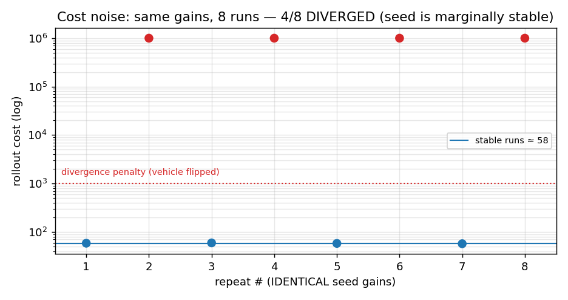
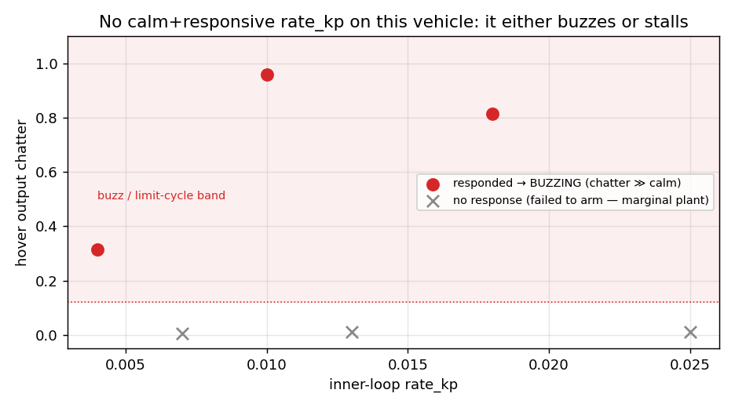
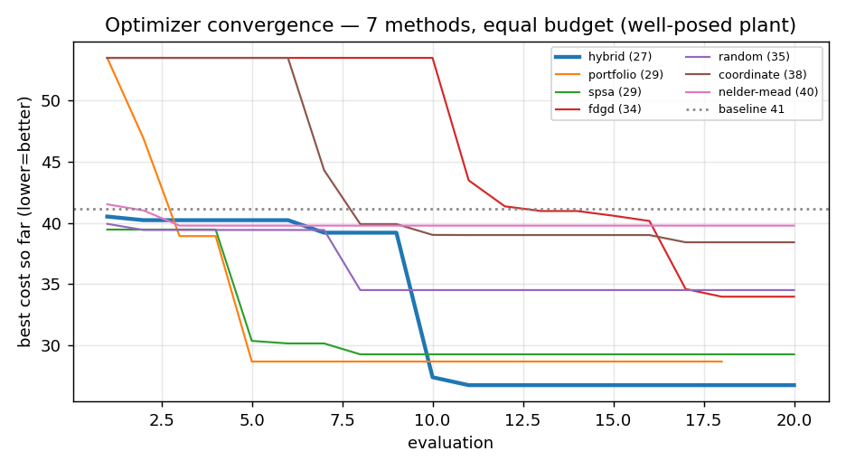
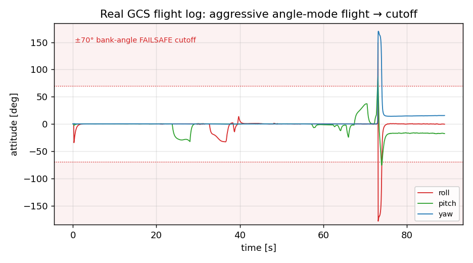

## 0. TL;DR

- We tune a **cascaded angle → rate PID** controller for a quad, in a **headless
  SITL** sim, by **black-box optimization**: perturb gains → fly a scripted
  excitation → score the response → repeat.
- The cost is a **non-differentiable, noisy** function of the gains, so "gradient
  descent" means *estimated*-gradient or derivative-free methods. We implement
  seven: random, coordinate/pattern descent, finite-difference gradient descent,
  **SPSA**, **Nelder–Mead**, and two meta-strategies (**hybrid**, **portfolio**).
- The dominant practical difficulties are **plant physics** (a low-stability-margin
  inner loop, gyro-noise/limit-cycle limits on `rate_kp`, weak yaw authority,
  mag-less heading drift) and **measurement noise** (real-time rollouts, flaky
  arming). These matter more than the choice of optimizer.
- Other software splits two ways: **closed-loop autotuners** that learn in flight
  (ArduPilot's twitch method, PX4's system-identification model-fit) and
  **assisted manual tuning** (Betaflight's sliders + blackbox step-response, with
  the real magic in *filtering* — RPM/dynamic-notch — not the PID search).

---

## 1. The plant we are tuning

### 1.1 Cascaded control structure

```
stick → [ANGLE PID] → rate setpoint → [RATE PID] → motor mix → 4 ESC duties → physics
              ▲                              ▲
       attitude estimate (Mahony)      gyro (body rates)
```

- **Outer (angle) loop** — `src/control/angle_controller.c`. P-only today
  (`Kp` set, `Ki = Kd = 0`). Maps attitude error → a **body-rate setpoint**.
  Runs ~1 kHz, RC/attitude-driven.
- **Inner (rate) loop** — `src/control/angle_rate_controller.c`. Full PID with
  **derivative-on-measurement**, a first-order **low-pass on the D term**
  (`d_lpf_rc`), **anti-windup** (integrator clamp `i_max`, freeze-on-saturation,
  derivative clamp `d_max`), a low-throttle integrator gate, and an authority
  ramp. Event-driven by IMU samples (~200 Hz in SITL, ≤5 ms timeout).

The PID core (`src/control/pid.c`), per update (error $e=\text{sp}-\text{meas}$):

$$
\begin{aligned}
P &= K_p\, e \\
I &= \operatorname{clamp}\!\big(I + K_i\, e\, \Delta t,\; \pm i_{\max}\big)
     \quad(\text{frozen if } P{+}I \text{ saturates}) \\
D &= \operatorname{LPF}\!\Big(-K_d\, \tfrac{\Delta(\text{meas})}{\Delta t}\Big),
     \qquad D \leftarrow \operatorname{clamp}(D,\, \pm d_{\max}) \\
\text{out} &= \operatorname{clamp}\!\big(P + I + D + K_{ff}\,\dot{s}_p,\;
     \text{out}_{\min},\, \text{out}_{\max}\big)
\end{aligned}
$$

Derivative-on-measurement avoids the "derivative kick" on setpoint steps; the
D-LPF tames the noise that differentiation amplifies (see §6).

### 1.2 The motor mix (allocation)

For a quad, the controller emits a wrench command `[throttle, roll, pitch, yaw]`
that must be allocated to four motor duties. We use a **geometry-derived sign
mix** (`angle_rate_controller.c`):

$$\text{out}_i = \text{thr} + \text{roll}\cdot(-\operatorname{sign} y_i) + \text{pitch}\cdot(\operatorname{sign} x_i) + \text{yaw}\cdot\text{spin}_i$$

where `(xᵢ, yᵢ)` is motor *i*'s body position and `spinᵢ ∈ {+1,−1}` its rotation.
This reproduces the legacy hardcoded X-quad mix exactly for the default layout
and **adapts to any quad layout**. It matters because the firmware mix and the
sim physics must agree on *which motor is where*: a Y-mirrored vehicle with a
fixed mix inverts the roll feedback → the craft is stable *inverted* → the tuner
sees a permanent divergence. One geometry source now drives both the firmware
mix and the sim physics (see `pid-autotuner` notes).

### 1.3 Why this is a control problem, not just curve-fitting

The closed loop has **delay** (sensor → estimate → control → mix → motor spin-up
→ rotation → sensor), **nonlinearities** (gyro deadband, motor saturation,
anti-windup), and **noise** (IMU). The achievable gains are bounded by stability
margin, not by tracking ambition. This is the crux of §6.

---

## 2. The autotune problem, formally

Let $\theta \in \mathbb{R}^n$ be the gain vector (e.g. `rate_kp, rate_ki,
rate_kd, angle_kp, gyro_lpf`, optionally a yaw set). Define a **rollout**
$R(\theta)$: reset the sim to a known state, apply $\theta$, excite the vehicle,
record the telemetry traces, and map them to a scalar **cost** $J(\theta)$. We seek

$$\theta^{*} = \operatorname*{arg\,min}_{\theta}\; J(\theta)
\qquad \text{subject to}\quad \theta_{\text{lo}} \le \theta \le \theta_{\text{hi}}$$

Three properties define everything that follows:

1. **Black-box** — `J` is only available by *running the simulator*. There is no
   closed form and no analytic gradient ∇J. Anything calling itself "gradient
   descent" here uses an **estimated** gradient.
2. **Noisy** — `J(θ)` is stochastic. The same θ scored twice differs (IMU noise,
   OS scheduling jitter on the real-time multi-process FIFO loop, occasional
   arming hiccups, and genuinely chaotic limit cycles near the stability edge).
   We saw a seed evaluate to 39.5 and 78 in the *same run*.
3. **Expensive** — each rollout is **wall-clock real time** (~5–7 s); `vsim_d` is
   paced to the IMU rate. A budget of 30 rollouts ≈ 3–4 min.

### 2.1 The cost function

Per excited axis, from the `(setpoint, measured, output)` traces over a
step-doublet window:

$$J_{\text{axis}} \;=\; \underbrace{\text{IAE}}_{\text{tracking}}
\;+\; \underbrace{3\cdot\text{overshoot}}_{\text{peak}}
\;+\; \underbrace{25\cdot\max(0,\; \text{chatter}-0.04)}_{\text{steady chatter (dead-zone)}}$$

- **IAE** = mean |setpoint − measured| over the window [deg] — the dominant
  tracking term.
- **overshoot** = `(max|measured| − target)/target`, normalized.
- **chatter** = mean |Δoutput| of the controller output between samples — a proxy
  for motor buzz / limit cycling. The **dead-zone** (free below 0.04, punished
  hard above) is the key design choice: a pure linear chatter weight makes the
  optimizer retreat to *do-nothing* (low gain = low chatter = sluggish), while no
  chatter term lets it pick *twitchy* gains that track but vibrate. The dead-zone
  finds the responsiveness-vs-buzz **knee** — push gains up until they *start* to
  chatter, then stop.
- **Divergence guard** — any axis with `|angle| > 80°` (flip) or NaN returns a
  large penalty (`1e6`), keeping the search inside the stable region.

Total cost sums the excited axes. A **baseline-divergence guard** aborts the
whole run if the seed gains already diverge (almost always a motor-layout
mismatch), instead of grinding pointlessly.

### 2.2 The excitation and the test rig

- **Test-rig mode** (`vsim_d` `VSIM_CTL_SET_TESTRIG`) pins the body's translation
  and zeroes linear velocity, leaving rotation free — a frictionless **attitude
  gimbal**. This is the single most useful piece of infrastructure: clean,
  repeatable attitude responses without the craft drifting, needing altitude
  hold, or crashing. Rotational dynamics are independent of translation, so this
  doesn't distort what we measure.
- **Excitation** = a **step doublet** per axis (stick → ~21° angle command, hold,
  return), which exercises rise, overshoot, settling, and steady chatter in one
  shot. (Aside: the firmware's cubic stick expo means a "full" command needs a
  large stick deflection; we account for this.)

---

## 3. The optimization algorithms

All seven minimize the same noisy `J` over box bounds, sharing one `Evaluator`
(global eval budget + running best + history). Below: the math, the per-iteration
cost, and when each shines. (`span_i = θ_hi,i − θ_lo,i`.)

### 3.1 Random search (baseline)

Sample `θ ~ Uniform(θ_lo, θ_hi)`, keep the best. Zeroth-order, no model. O(1)
eval/sample. Embarrassingly robust to noise (no state to corrupt) but scales
terribly with dimension — coverage of an n-cube needs exponentially many
samples. We keep it as a sanity baseline and as the *exploration* phase of
`hybrid`.

### 3.2 Coordinate / pattern descent

Probe `θ ± s·span` along each axis; accept any improving move; when a full sweep
yields no improvement, shrink `s ← σ·s` (σ=0.5) until `s < s_min`.

```
for each axis i, each sign ∈ {+,−}:
    cand = θ;  cand_i += sign·s·span_i
    if J(cand) < J(θ):  θ ← cand
if no axis improved:  s ← σ·s
```

Simple and derivative-free. ~`2n` evals per sweep. **Weakness:** axis-aligned
moves get trapped in diagonal valleys, and a single noisy "improvement" can send
it sideways. In our runs it stalls near the seed within a small budget.

### 3.3 Finite-difference gradient descent (FDGD) — the literal "gradient descent"

Estimate the gradient by **central differences**, then step downhill:

$$\hat{g}_i = \frac{J(\theta + h\,e_i) - J(\theta - h\,e_i)}{2h},\quad
h = \varepsilon\,\text{span}_i
\qquad\Longrightarrow\qquad \theta \leftarrow \operatorname{clamp}(\theta - \eta\,\hat{g})$$

**2n evaluations per step** (n = dimension). This is what most people *mean* by
"gradient descent," and we expose it — but it is the **most noise-sensitive**
method here: each ĝ_i is a difference of two noisy numbers divided by a small
`h`, so measurement noise is amplified by `1/h`. Practical only at small n with
low-noise cost (or heavy averaging).

### 3.4 SPSA — Simultaneous Perturbation Stochastic Approximation *(recommended)*

The key idea (Spall, 1992): estimate the **whole gradient with just two
evaluations**, by perturbing *all* parameters at once along a random direction.

Draw a random sign vector $\Delta_k$, with each $\Delta_{k,i}$ i.i.d.
**Bernoulli $\pm 1$**. Then

$$\hat{g}_{k,i} = \frac{J(\theta_k + c_k \Delta_k) - J(\theta_k - c_k \Delta_k)}
{2\,c_k\,\Delta_{k,i}}, \qquad \theta_{k+1} = \theta_k - a_k\,\hat{g}_k$$

with the standard decaying **gain schedules** (the exponents are asymptotically
optimal):

$$a_k = \frac{a}{(k+1+A)^{\alpha}}, \qquad c_k = \frac{c}{(k+1)^{\gamma}},
\qquad \alpha = 0.602,\;\; \gamma = 0.101$$

Why it works despite the "wrong-looking" gradient: although any single ĝ_k is a
*biased-looking* estimate of one component, its **expectation aligns with the
true gradient** (the cross terms vanish in expectation because the `Δ_i` are
independent and zero-mean). So it's a valid stochastic-gradient method, and the
**2 evals/step is independent of dimension** — a 4-D and a 40-D problem cost the
same per step. The decaying `c_k` also *averages out noise* over iterations,
making SPSA far more noise-tolerant than FDGD. This is our default and one of the
two top performers in head-to-head runs.

### 3.5 Nelder–Mead (downhill simplex)

A derivative-free direct-search method that maintains a **simplex** of `n+1`
points and crawls downhill by geometric moves. Order the vertices by cost; let
$\bar{x}$ be the centroid of the best $n$; reflect the worst $x_w$ through it:

- **Reflect:** $x_r = \bar{x} + \alpha(\bar{x} - x_w)$, with $\alpha = 1$.
- **Expand:** if $x_r$ is the new best, $x_e = \bar{x} + \gamma(\bar{x} - x_w)$,
  $\gamma = 2$ (keep the better of $x_r, x_e$).
- **Contract:** else if $x_r$ is poor, $x_c = \bar{x} + \rho(x_w - \bar{x})$,
  $\rho = 0.5$.
- **Shrink:** if all else fails, pull every vertex halfway to the best,
  $\sigma = 0.5$.

Good on smooth, low-dimensional surfaces; **fragile under noise** (a fluke "best"
vertex distorts the simplex) and prone to collapsing into a degenerate simplex —
we restart it when the spread drops below a threshold. Middling here.

### 3.6 Hybrid (global explore → local refine) *(top performer)*

A simple **global+local** composition: spend the first fraction of the budget on
**random exploration** to find a good basin, then run **SPSA** from the best
point found.

```
explore ~35% of budget with random sampling  →  best basin x₀
refine remaining budget with SPSA from x₀
```

This beats pure-local methods because the cost surface is **multimodal** (a
"do-nothing" basin, a "track-aggressively-but-buzz" basin, and the good
damped-and-responsive basin between them). Exploration escapes the seed; SPSA
polishes. In our `--compare` runs `hybrid` won (≈35% better than seed when the
plant was well-posed).

### 3.7 Portfolio

Split the budget across **SPSA + Nelder–Mead + coordinate descent**, all seeded
from the same point, and keep the global best. A hedge against any single
method's failure mode — consistently 2nd or 3rd, never last.

### 3.8 Comparison

| Method        | evals/step | dim scaling | noise tolerance | global? | notes |
|---------------|------------|-------------|-----------------|---------|-------|
| random        | 1          | very poor   | excellent       | yes     | baseline / explorer |
| coordinate    | ~2n        | poor        | poor            | no      | traps in valleys |
| fdgd          | 2n         | poor        | **poor**        | no      | literal ∇; noise×1/h |
| **spsa**      | **2**      | **flat**    | good            | no      | default; scales to any n |
| nelder-mead   | 1–n        | moderate    | poor            | no      | smooth-surface only |
| **hybrid**    | mixed      | good        | good            | **yes** | explore→SPSA; best |
| portfolio     | mixed      | good        | good            | partial | robust hedge |

**Lesson learned:** on *this* plant, the optimizer choice mattered less than the
cost/excitation design and the plant's own stability. A **structured
one-at-a-time sweep** (vary one gain, watch the response) found a calm-and-
responsive tune in ~3 short experiments that the black-box search missed across
many long runs — because a human-readable sweep is immune to the multimodal
noise that confuses an optimizer. Structured sweeps are underrated.

---

## 4. The noise problem (and mitigations)

The cost is noisy enough to dominate algorithm behavior:

- **Real-time rollouts** + multi-process FIFO scheduling jitter.
- **Flaky arming** between rollouts (reset → re-arm races) produced phantom
  "no-response" evals until we made arming verify motion / stay armed.
- **Limit cycles** near the stability edge are *chaotic* — a marginal tune flips
  in one rollout and not the next.

Mitigations in place: `--repeats N` (average N rollouts per eval), the
divergence penalty (so a flip is a clear large cost, not a misleading number),
the dead-zone chatter term (so the optimum is a real knee), an **apply-only-if-
better-than-baseline** safety (never persist a regression), and noise-tolerant
optimizers (SPSA / hybrid) by default.

---

## 5. How physics and harmonics shape the gains

Tuning is not arbitrary number-search; the *right* gains are dictated by the
airframe's dynamics. This section is the "why."

### 5.1 Rigid-body rotational dynamics

About each axis, to first order, $\tau = I\alpha$ (torque = inertia × angular
acceleration), with Euler cross-coupling $\tau = I\dot{\omega} + \omega \times
(I\omega)$. The control torque is produced by **differential thrust**:
$\tau_{\text{roll}} = \sum(-y_i)\,f_i$, $\tau_{\text{pitch}} = \sum(x_i)\,f_i$,
$\tau_{\text{yaw}} = \sum \text{spin}_i\,(k_{\text{moment}}/k_{\text{thrust}})\,f_i$.
Consequences:

- **Gains scale with the airframe.** Bigger inertia `I` or shorter arms (smaller
  `|x|,|y|`) ⇒ you need *more* gain for the same response. A 5″ freestyle quad and
  a 10″ cinelifter need wildly different numbers. This is exactly why a tuner must
  use the *real* geometry (and why we push `VSIM_CTL_SET_GEOMETRY`).
- **Yaw is the weak axis.** Yaw torque comes from rotor *reaction* (`k_moment`),
  which is ~60× smaller than thrust (`k_thrust`). So yaw needs higher gains and is
  slower — and saturating yaw output steals authority from roll/pitch through the
  mixer.

### 5.2 The cascade and bandwidth separation

The outer (angle) loop must be **slower** than the inner (rate) loop — a rule of
thumb is a 3–5× bandwidth separation — or the loops fight and oscillate. In our
plant the practical consequence was striking: **`angle_kp` is the safe
responsiveness lever** (you can raise it a lot and the craft tracks faster
without buzzing), whereas **`rate_kp` has a low ceiling** — above a knee (~0.01 in
sim units) the inner loop **limit-cycles** around the gyro deadband and motor
delay, producing the vibration. The fix for "more responsive" is usually *more
outer-loop P*, not more inner-loop P.

### 5.3 Delay, phase margin, and the stability ceiling

The loop has transport delay `T_d` (gyro filtering + scheduling + ESC/motor
spin-up time-constant + prop inertia). A proportional loop with delay is stable
only up to a gain set by the **phase margin**: at the frequency where the open
loop hits −180° of phase, the gain must be < 1 (Nyquist). More delay ⇒ lower max
`Kp`. **Filtering adds delay** — every low-pass you add to fight noise eats phase
margin and lowers your gain ceiling. This is the central tension of drone tuning:
*filter enough to not amplify noise, but not so much that you can't use any gain.*
(We saw this directly: adding a gyro input LPF *worsened* an outer-loop-driven
limit cycle because its phase lag reduced the margin.)

### 5.4 Derivative term ↔ noise amplification

`D` differentiates the (measured) rate. Differentiation multiplies a signal's
high-frequency content by `ω` — so D **amplifies gyro noise**. Hence `Kd` is
small, always paired with a **derivative low-pass** (`d_lpf_rc`), and on real
craft is the term most limited by noise. In our cost, raising `rate_kd` *increased*
chatter (D feeding on the deadbanded/noisy gyro), so its bound is tight.

### 5.5 Harmonics, resonance, and why filtering precedes PID

The gyro doesn't measure pure body rate; it measures body rate **+ vibration**:

- **Motor/prop harmonics.** Each motor injects noise at its rotation frequency and
  multiples (1×, 2×, 3× RPM). As throttle changes, these frequencies *sweep* —
  static filters can't track them.
- **Frame resonance.** The airframe, arms, stack mounts, and payload have
  mechanical resonances that ring when excited.
- **Aliasing.** Noise above the loop's Nyquist (½ the loop rate) folds back into
  the control band and is indistinguishable from real motion.

If this noise reaches the P/D terms, it is **amplified into the motors**, which
*adds* vibration — a destructive feedback loop. So the modern practice (Betaflight
especially) is **filter first, then tune PID**:

- **RPM filter** — ESCs report actual motor RPM (bidirectional DShot), and the FC
  places **notch filters exactly on each motor's harmonics** (typically 3
  harmonics/motor). Because it tracks RPM, it's precise and lets you *reduce*
  broadband low-pass (less delay → higher usable gain). The single biggest tuning
  advance of the last decade.
- **Dynamic notch** — tracks the dominant peaks in the gyro spectrum (frame
  resonance, bent props, GoPro mounts) that aren't motor-locked.
- **Static low-pass** — a last-resort broadband cut; cheap but adds delay.

Our SITL plant has only modest synthetic gyro noise and a deadband, so the
limiting harmonic phenomenon here is the **deadband limit cycle**, not motor
noise — but the same physics (noise/harmonics cap the gain) governs both sim and
hardware.

### 5.6 Yaw and the magnetometer

Yaw heading is unobservable from accel/gyro alone (gravity fixes roll/pitch, but
nothing fixes heading) — you need a **magnetometer**. Without one, the attitude
estimator's yaw **drifts**. Our sim has no mag, so absolute yaw-hold control
chases a phantom heading and spins out as the drift accumulates. The robust,
mag-independent thing to tune is the **yaw *rate* loop**; heading-hold gains
should be validated on hardware with a working compass.

---

## 6. How people tune today (manual practice)

Despite all the automation, most performance pilots still tune by hand. The
canonical workflow:

1. **Filters first.** Set up RPM filtering / dynamic notch from a blackbox log so
   the gyro is clean, *then* touch PID. Tuning PID on a noisy gyro chases ghosts.
2. **Inner rate loop, P then D.** Raise `P` until the craft shows fast
   oscillation / "hot" motors on hard moves, then back off ~10–20%. Add `D` to
   damp the overshoot P creates — `D` is the shock absorber. The community
   heuristic is a **P:D balance** (Betaflight's step-response tool targets a
   P/D ratio ≈ 1.0 for a critically-damped-looking step).
3. **I for hold/drift.** Raise `I` until the craft holds angle/rate against wind
   and bounces back to level after a punch-out without drifting; too much `I`
   gives slow oscillation and "bounce-back."
4. **Feedforward for tracking.** FF feeds stick *velocity* straight to the output
   so the craft follows fast stick inputs without waiting for error to build —
   crisp response without raising P. (Betaflight's FF has jitter-reduction /
   smoothing so it doesn't amplify radio steps.)
5. **Outer angle loop** (for self-leveling modes) last, kept slower than the rate
   loop.

**Measurement, not feel.** Serious tuning is data-driven: **blackbox logging** +
tools like **PIDtoolbox / Blackbox Explorer** compute the **step response** and
noise spectrum from real flight, so you tune to a *graph* (rise time, overshoot,
damping, noise floor), not vibes.

**The classical control-theory methods** behind all of this:

- **Ziegler–Nichols** — raise P until sustained oscillation (the *ultimate gain*
  $K_u$ and period $T_u$), then set $K_p=0.6K_u,\ K_i=1.2K_u/T_u,\ K_d=0.075K_u T_u$.
  Rarely used directly on drones (the oscillation test is dangerous) but it's the
  conceptual ancestor.
- **Relay (Åström–Hägglund) auto-tuning** — replace the controller with a relay to
  induce a *controlled* limit cycle, measure its amplitude/period to get `K_u,T_u`
  without a risky manual sweep. The basis of many industrial auto-tuners.

---

## 7. Autotune in other drone software (research)

### 7.1 ArduPilot — AUTOTUNE (twitch / step-response search)

A flight mode that **twitches** the craft (~20° on multirotors) on one axis at a
time and watches the response, **incrementing the rate `P`/`D` (and angle `P`)**
toward target rise-time/overshoot/bounce-back metrics. It requires the twitch to
pass its targets **4 times in a row** before advancing, and tunes roll, pitch and
**yaw** (yaw modifies `ATC_RAT_YAW_FLTE`, the yaw error filter, rather than `D`).
An **`AUTOTUNE_AGGR`** parameter (0.05 weak … 0.1 aggressive) trades response vs
margin. It also encodes domain heuristics (e.g. for roll/pitch `P≈I`, `D≈P/10`;
for yaw `I≈P/10`, `D≈0`). Conceptually it is a **constrained coordinate search
with response-metric targets** — close in spirit to our coordinate/step-response
approach, but closed-loop in real flight.

### 7.2 PX4 — system-identification auto-tuner *(model-based)*

PX4 takes a fundamentally different, **model-based** route. While flying a maneuver
that drives each axis to ~75% of its max rate, it does **online system
identification**: it fits a **low-order SISO linear model per axis** (≈2 poles, 2
zeros — i.e. an ARX/transfer-function model, no inter-axis coupling) to the
input/output data, then **computes the PID gains analytically** from that model.
Because it identifies the *plant*, it's fast and needs no manual iteration — but
it's sensitive to **signal-to-noise ratio** (a noisy/under-excited vehicle yields
a bad model → bad gains). More advanced offline variants (e.g. `px4_pid_tuner`)
fit a 2nd-order model from logs (SIPPY) and place gains via **LQR + genetic
optimization** (DEAP).

This is the major philosophical split: **identify-then-place** (PX4) vs.
**search-the-cost-directly** (ArduPilot, and us). Model-based is sample-efficient
and elegant when the model fits; direct search is model-free and robust to
weird/nonlinear plants but needs many noisy evaluations.

### 7.3 Betaflight / INAV — assisted manual, not closed-loop autotune

Betaflight has **no in-flight closed-loop PID autotuner**. Instead it provides:

- **PID sliders** — a small set of coupled sliders (master gain, P/D ratio, D
  min/max, feedforward, pitch:roll ratio) that move many parameters along
  expert-curated curves, so a human gets to a good tune in a few moves.
- **Step-response analysis** (PIDtoolbox) from blackbox to *judge* a tune.
- The real investment is in **filtering** (RPM filter, dynamic notch) and **feed-
  forward**, on the (correct) premise that *noise management and FF* dominate
  perceived flight quality more than the exact PID triple.

The takeaway for us: a credible product isn't just an optimizer — it's
**clean measurement + good excitation + a sane parameterization**, with the search
on top.

### 7.4 Where Vayu's autotuner sits

| Axis              | ArduPilot | PX4 | Betaflight | **Vayu (this repo)** |
|-------------------|-----------|-----|------------|----------------------|
| Strategy          | step-response search | system-ID + analytic | assisted manual | **black-box derivative-free search** |
| Where it runs     | in flight | in flight | bench (human) | **SITL (offline), same firmware** |
| Model needed      | no        | yes (2p2z) | no | **no** |
| Optimizers        | bespoke   | analytic/LQR+GA | — | **7 (SPSA, hybrid, NM, …)** |
| Risk              | real aircraft | real aircraft | none | **none (sim)** |
| Hardware transfer | direct    | direct | direct | **needs sim-fidelity / re-validate** |

Our distinctive properties: it runs against the **exact firmware control code** in
SITL (no separate model), it's **risk-free** (no real aircraft), and it can A/B
many optimizers. Its weakness is the flip side of being offline: gains are only as
good as the sim's fidelity (motor model, inertia), so they're a *seed* to validate
on a tethered bench, not a final hardware tune.

---

## 8. Case study — "the cost won't drop" (real log data)

This is the concrete problem we hit while tuning a real loaded vehicle (a
lighter-inertia quad: body inertia `Ixx≈0.0068, Izz≈0.0134 kg·m²`, roughly half
the default — i.e. *twitchier*). Symptom: the autotune cost sat high and refused
to drop. The data below (all from this repo's logs/SITL) shows it is **a plant +
measurement problem, not an optimizer problem.**

### 8.1 The cost is a coin-flip (bimodal noise)

Running the **identical seed gains** eight times produces two clusters: ~58 when
the rollout stays upright, and the **1e6 divergence penalty** when it flips —
**4 of 8 diverged.**



The seed is **marginally stable** on this airframe: the 21° step doublet provokes
a flip about half the time. A cost that randomly returns 58 or 1,000,000 for the
*same input* has no usable gradient — SPSA's two-point difference, finite
differences, and Nelder–Mead's vertex ranking are all dominated by which side of
the coin came up, not by the gains. **You cannot descend a coin-flip.** (This is
exactly the regime PX4's docs warn about as "low signal-to-noise.")

### 8.2 There is no calm-and-responsive gain to find

Sweeping the inner-loop `rate_kp` across its range, the rollouts that *responded*
all **buzz** (hover output chatter 0.3–0.96, vs ~0.01 for a calm loop); the rest
**failed to even arm/respond** — the harness flakiness that marginal stability
induces.



So there is no `rate_kp` on this vehicle (in this regime) that is simultaneously
responsive *and* quiet — the usable window has collapsed. Raising gain to recover
authority just moves you from "stalls" to "buzzes/flips."

### 8.3 The search itself is fine — on a well-posed plant

On a well-conditioned plant (default geometry, budget 20) the **same optimizers
converge cleanly** — `hybrid` ≈ −35%, monotone best-so-far curves, the local
methods stalling near the seed as expected:



The contrast is the whole point: identical code, identical optimizers — the only
difference is the **plant's stability margin and the resulting cost noise.**

### 8.4 What the vehicle actually does in flight

For grounding, a real GCS flight log (`logs/sim-2026-06-04_03-26-58.bin`,
decoded): aggressive angle-mode sticks drive the craft past the **±70°
bank-angle cutoff → FAILSAFE** (the safety working as designed), confirming the
craft is controllable but lives close to its limits under hard input.



### 8.5 Diagnosis and the path out

- **What we already fixed:** the *systematic* divergence (a motor-layout/mixer
  mismatch that pinned the craft inverted at −160°, baseline ≈ 500,000) is gone —
  the geometry-aware mixer dropped the baseline to ~58 (stable). The *residual* is
  **marginal-stability noise**, not a mixer bug.
- **Why more optimizer budget won't help alone:** with a 50% flip rate you'd need
  many averaged rollouts per eval just to estimate the cost — and rollouts are
  real-time, so that's minutes per point. This is the strongest argument for a
  **faster-than-real-time sim** (afford heavy averaging) — see §9.
- **The real fixes, in order of leverage:**
  1. **Gentler excitation** — a smaller step (≈8–12° instead of 21°) so the
     marginal seed doesn't flip, converting the bimodal cost into a clean signal
     the search can descend. (Cheapest, highest-impact next step.)
  2. **A stable seed first** — you cannot optimize from inside a divergent basin.
     A short structured sweep or a hardware/bench pass to a known-stable gain set
     gives the search somewhere to start.
  3. **System identification** (PX4-style, §7.2) — fit a 2nd-order model from one
     chirp and *place* gains analytically, sidestepping the noisy search entirely.

The honest one-liner: **the autotuner is working correctly; it is faithfully
reporting that this vehicle's seed gains are on the edge of stability.** The fix
is to move the operating point (excitation/seed/model), not to push the optimizer
harder against noise.

---

## 9. Honest assessment & future directions

- **Biggest wins available:** (1) **faster-than-real-time / lockstep** stepping in
  `vsim_d` so rollouts aren't wall-clock bound (10–50× more evals per minute);
  (2) **system identification** — fit a 2nd-order model per axis from one chirp/
  relay excitation and *place* gains (PX4-style), turning a 30-rollout search into
  a handful of experiments; (3) a **relay-autotune seed** to get `K_u,T_u` cheaply.
- **Cost/excitation** is where most of the quality lives — the dead-zone chatter
  term and a clean excitation mattered more than the optimizer. A frequency-domain
  cost (gain/phase margin from a chirp) would be more principled than the
  time-domain doublet.
- **Don't over-trust the search on a noisy plant** — structured one-at-a-time
  sweeps remain the fastest path to *understanding*, and understanding beats a
  black box when the cost is this noisy.

---

## 10. Sources

- ArduPilot AutoTune — Copter: <https://ardupilot.org/copter/docs/autotune.html> ·
  Plane: <https://ardupilot.org/plane/docs/automatic-tuning-with-autotune.html> ·
  wiki source: <https://github.com/ArduPilot/ardupilot_wiki/blob/master/copter/source/docs/autotune.rst>
- PX4 Auto-Tuning — MC: <https://docs.px4.io/main/en/config/autotune_mc> ·
  FW: <https://docs.px4.io/main/en/config/autotune_fw> ·
  MC manual PID guide: <https://docs.px4.io/main/en/config_mc/pid_tuning_guide_multicopter>
- PX4 log-based sysID + LQR/GA tuner: <https://github.com/mzahana/px4_pid_tuner> ·
  GA + system-ID autopilot tuning (survey): <https://www.sciencedirect.com/science/article/pii/S1270963824009088>
- Betaflight tuning — sliders/FF/step response: <https://betaflight.com/docs/wiki/tuning/4-3-Tuning-Notes> ·
  blackbox PID/filter tuning (Oscar Liang): <https://oscarliang.com/pid-filter-tuning-blackbox/> ·
  RPM filter: <https://oscarliang.com/rpm-filter/>
- Vayu autotuner source: `tools/autotune/` (`autotune.py`, `optimizers.py`,
  `sitl.py`, `protocol.py`); control loops `src/control/`; sim `sim/vsim/`.
- SPSA: J. C. Spall, "Multivariate Stochastic Approximation Using a Simultaneous
  Perturbation Gradient Approximation," IEEE TAC, 1992.
