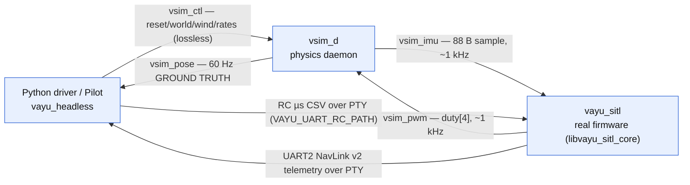
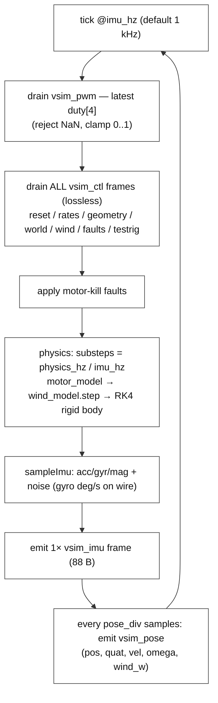
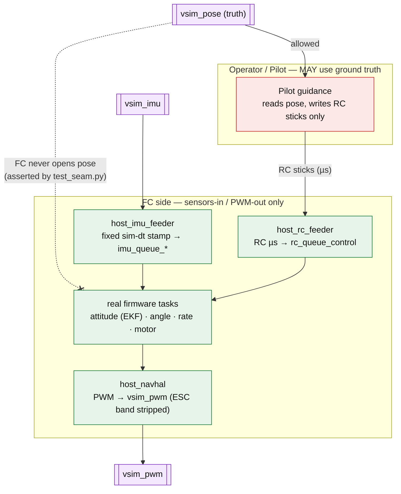
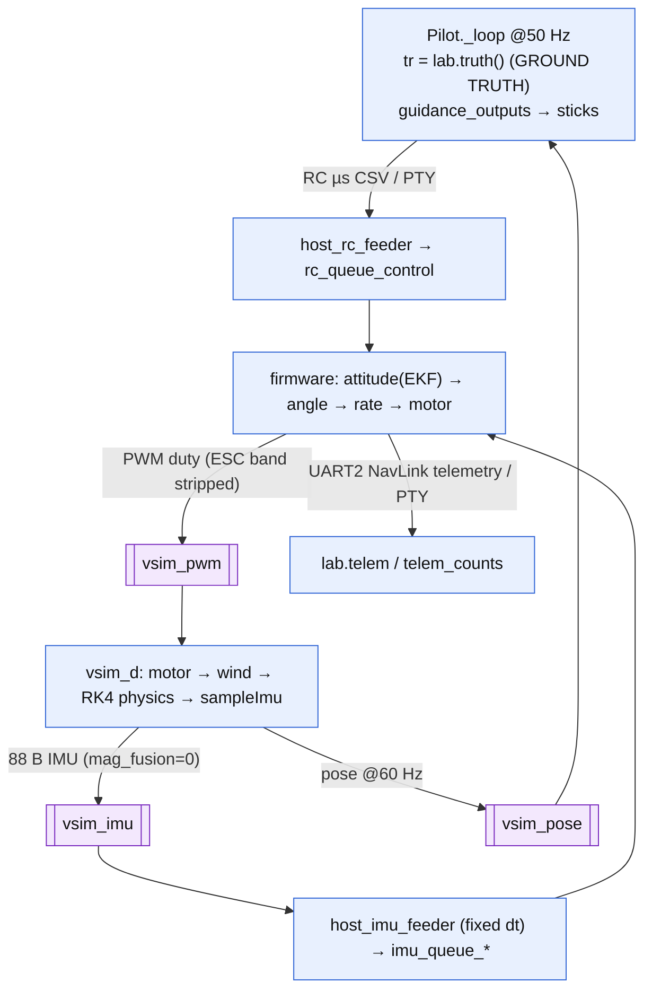
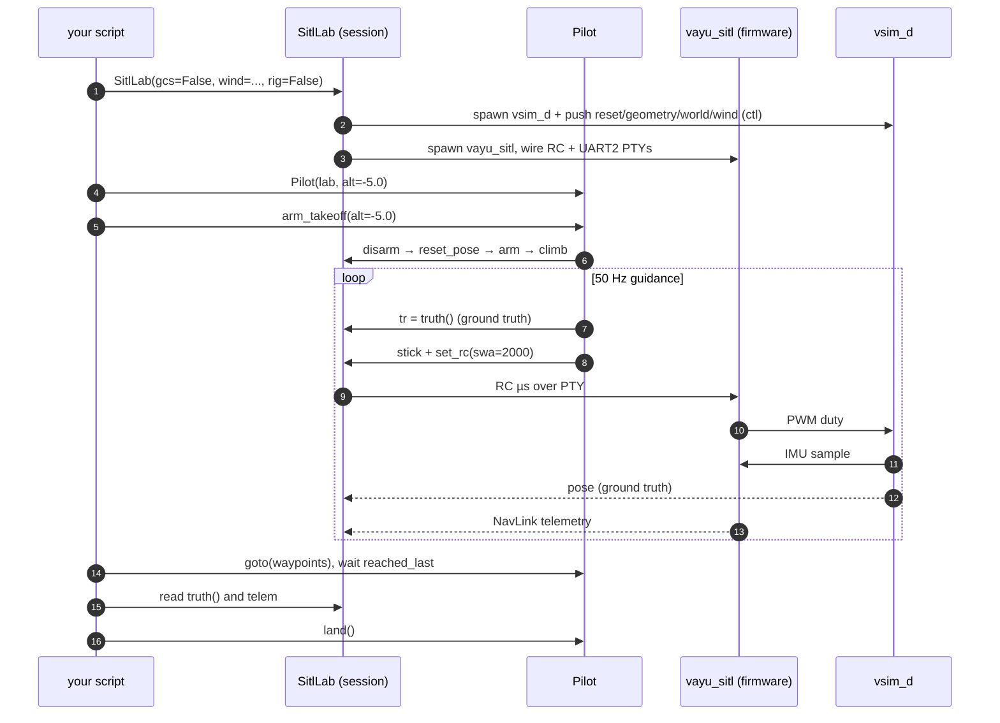

# Sim & SITL architecture (with the Pilot scripting API)

A complete map of the simulation stack: the `vsim_d` physics daemon, how the
**real firmware** runs headlessly against it (SITL), the seam that keeps the FC
honest, and the **`vayu_headless` Pilot** — the Python API you script flights with.
Verified against `tools/vsim/`, `tools/sim_host/`, and `software/headless-sdk/`.

> Companion docs: firmware internals → [`../../../../docs/reference/software-flow.md`](../../../../docs/reference/software-flow.md);
> wire protocol → [`../../include/vsim_proto.h`](../../include/vsim_proto.h);
> the GCS that also hosts this sim in-process → [`../../../../software/docs/reference/gcs-architecture.md`](../../../../software/docs/reference/gcs-architecture.md).

## The three processes

| Process | Binary / package | Role |
|---|---|---|
| **vsim_d** | `tools/vsim` → `vsim_d` | Rigid-body physics, sensor synthesis, world/wind. The *plant*. |
| **vayu_sitl** | `tools/sim_host` → `vayu_sitl` (links `libvayu_sitl_core.a`) | The **real firmware** control logic compiled for the host. The *flight controller*. |
| **driver / Pilot** | `software/headless-sdk` → `vayu_headless` | Orchestration: spawns both, injects RC, reads telemetry + ground truth, flies trajectories, scores fidelity. |

They connect over four `/tmp` **FIFOs** plus two **PTYs**, isolated per session by
`VSIM_FIFO_SUFFIX` (e.g. `_lab<pid>`) so concurrent runs never collide.

---

## 1. Processes & transport



All `/tmp/vsim_*` paths carry the `VSIM_FIFO_SUFFIX`. PWM/IMU/POSE are **latest-wins**
(a slow reader just drops stale frames); **CTL is lossless** (`pollNext`) because the
startup burst — rates, geometry, world, wind — must all apply.

> **GCS in-process variant:** when the firmware is linked *inside* Navigator instead of
> run as `vayu_sitl`, PWM/IMU/pose still ride the FIFOs, but UART2 telemetry is delivered
> by an in-process callback rather than a PTY. See the GCS doc, "In-app sim hosting".

*Source: `tools/vsim/include/vsim_proto.h:305-308`, `software/headless-sdk/vayu_headless/session.py:44-154`, `vayu_headless/paths.py`.*

---

## 2. `vsim_d` per-tick loop

Single thread paced by `clock_nanosleep` at `imu_hz` (default 1 kHz; physics 8 kHz,
pose 60 Hz — all live-reconfigurable via `SET_RATES`).



### CTL opcodes (driver/viewer → sim, `vsim_proto.h:123-138`)

| # | Opcode | Effect |
|--:|--------|--------|
| 1 | `RESET` | respawn pose/vel; `seed≠0` re-seeds sensor+wind RNG (deterministic) |
| 2 | `PAUSE` | freeze physics |
| 3 | `SET_NOISE` | per-sensor σ + enable (enable=0 → dropout) |
| 5 | `SET_GEOMETRY` | mass + inertia[9] + 4 motor mounts |
| 6 / 10 / 11 | `SET_WORLD` / `SET_WORLD_MESH` / `CLEAR_WORLD_MESH` | gravity/ground/drag; mmap BVH world |
| 7 / 8 | `CLEAR_OBSTACLES` / `ADD_OBSTACLE` | primitive obstacles |
| 9 | `SET_RATES` | live re-rate imu/physics/pose |
| 12 | `SET_TESTRIG` | autotune attitude rig (soft tether `tether_k`) |
| 13 | `SET_FAULTS` | per-motor kill + imu dropout |
| **14** | **`SET_WIND`** | steady + gust + Dryden turbulence |

*Source: `tools/vsim/src/main.cpp:205-520`, `sim_controller.cpp`, `physics_core.cpp`.*

---

## 3. The SITL seam (what keeps the FC honest)

The contract: **the FC is sensors-in / PWM-out only and must behave exactly as on real
hardware**; the operator/Pilot *may* use ground truth. So the firmware host opens the
**IMU** FIFO and the **RC/UART** PTYs — but **never** the **pose** (ground-truth) FIFO.
A runtime test enforces it by inspecting the FC process's open file descriptors.



*Source: `tools/sim_host/src/host_imu_feeder.c`, `host_navhal.c`, `host_lifecycle.c:179-191`,
`software/headless-sdk/tests/integration/test_seam.py:29-62`.*

---

## 4. End-to-end data flow (one closed loop)



The control loop closes once per IMU sample (1 kHz). Pose and UART2 telemetry are the
read-only taps the script consumes — **ground truth** (`truth()`) vs the **FC's own
estimate** (`telem["AttitudeEuler"]`) are read separately, which is how fidelity is scored.

---

## 5. Pilot — the scripting API

`vayu_headless` is the installable package you script against. Public surface
(`vayu_headless/__init__.py`): `SitlLab` (a.k.a. `SitlSession`), `Pilot`, `DEFAULT_GAINS`.



Minimal mission (`examples/box_mission.py`):

```python
from vayu_headless import SitlSession, Pilot

with SitlSession(gcs=False) as lab:        # spawns vsim_d + vayu_sitl
    pilot = Pilot(lab, alt=-5.0)
    pilot.arm_takeoff(alt=-5.0)
    pilot.goto([(s,0),(s,s),(0,s),(0,0)], alt=-5.0)
    while not pilot.reached_last():
        time.sleep(0.2)
    truth = lab.truth()                    # ground-truth pose/vel/att
    fc_est = lab.telem.get("AttitudeEuler")# FC's own estimate
    pilot.land()
```

### API surface

| Call | What it does |
|------|--------------|
| `SitlLab(rig, wind, turb, rc_hz, gcs, attach, vveh)` | start a session (spawns both binaries, wires FIFOs/PTYs) |
| `arm(settle)` / `disarm()` | arm / disarm the FC |
| `set_rc(roll,pitch,thr,yaw,swa)` / `stick(...)` | inject RC (raw µs / normalized) |
| `lab.telem`, `lab.telem_counts` | decoded **FC telemetry** (NavLink) + per-message counts |
| `truth()` | **ground truth** `{pos,quat,vel,omega,motor_omega,wind}` (from pose FIFO) |
| `reset_pose(pos)` | teleport the sim body |
| `Pilot(lab, alt, gains, reach)` | guidance autopilot (50 Hz, **writes RC sticks only**) |
| `arm_takeoff` · `goto(wps)` · `reached_last` · `land` | mission primitives |

The CLI wraps the same: `vayu-headless serve | do | run` (`cli.py`). Trajectory generators
(e.g. the Gerono **lemniscate / figure-8**) live in `examples/figure8.py` and feed
`goto` — they are not built into the library.

*Source: `vayu_headless/session.py`, `autopilot.py`, `server.py`, `cli.py`, `examples/`.*

---

## 6. Autotune over sim (brief)

`tools/autotune` drives `vsim_d` **directly over the raw FIFO/PTY protocol** (not the SDK):
it spawns its own `vsim_d` + `vayu_sitl` under an isolated suffix, sends `SET_TESTRIG`
(opcode 12, a *soft* tether so the accelerometer still sees thrust-tilt — a hard pin
over-tunes), runs per-axis step doublets, scores the captured `CONTROL_TRACE` telemetry,
and pushes gains via `CMD_SET_PID`. See [`autotune-methodology.md`](autotune-methodology.md).

---

## Reference: FIFOs & key files

| FIFO | Dir | Frame | Rate |
|------|-----|-------|------|
| `vsim_pwm` | FC → sim | `duty[4]` | ~1 kHz latest-wins |
| `vsim_imu` | sim → FC | 88 B sample | ~1 kHz latest-wins |
| `vsim_pose` | sim → driver/GCS | pos/quat/vel/omega/wind | 60 Hz latest-wins |
| `vsim_ctl` | driver → sim | opcode + body | async lossless |

| File | Role |
|------|------|
| `tools/vsim/include/vsim_proto.h` | wire protocol: FIFOs, header, opcodes, payloads |
| `tools/vsim/src/main.cpp` | daemon loop, CTL dispatch, physics/IMU/pose emit |
| `tools/vsim/src/{sim_controller,physics_core}.cpp` | per-tick orchestration + RK4 integrator |
| `tools/sim_host/src/host_lifecycle.c` | boots the real firmware tasks on the host |
| `tools/sim_host/src/host_imu_feeder.c` | IMU FIFO → imu queues (fixed sim-dt) |
| `tools/sim_host/src/host_navhal.c` | PWM → FIFO; UART2 telemetry PTY |
| `software/headless-sdk/vayu_headless/{session,autopilot,server,cli}.py` | the scripting SDK + Pilot |
| `software/headless-sdk/fidelity/*` | maneuver metrics + FC-vs-operator fidelity scoring |

## Notes & caveats (verified)

- **`mag_fusion` is zero on the SITL wire:** `vsim_d`'s `packImu` writes 76 of the 88 IMU
  payload bytes (acc/gyr/mag/raw/temp); the estimator-input `mag_fusion[3]` is left
  zero-filled, so the FC's estimator sees a zeroed fusion-mag in SITL.
  (`tools/vsim/src/main.cpp:100-116`, `vsim_types.h:73-77`.) The host feeder validates the
  full 88-byte frame and now bails after 64 consecutive mismatched frames — a stale `vsim_d`
  at the wrong `VSIM_PROTO_VERSION` is diagnosed rather than spun on (`host_imu_feeder.c`).
- **Pose v3 fields `airspeed` / `ge_factor` / `batt_*` emit zero** — only `wind_w` is filled.
- The firmware-host I/O comments still mention host-side Mahony; that was **removed** as a
  fidelity violation — the host injects raw IMU only and the firmware's own EKF runs.
- No built-in figure-8/lemniscate in `Pilot`; the generator lives in `examples/`.
