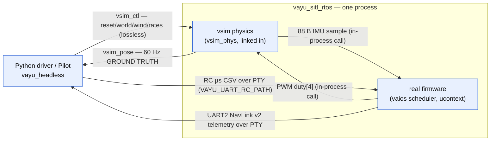
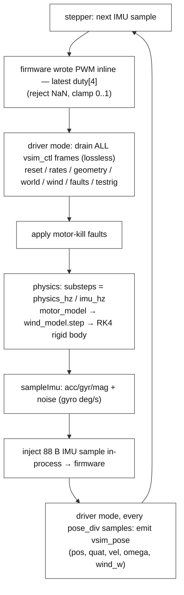
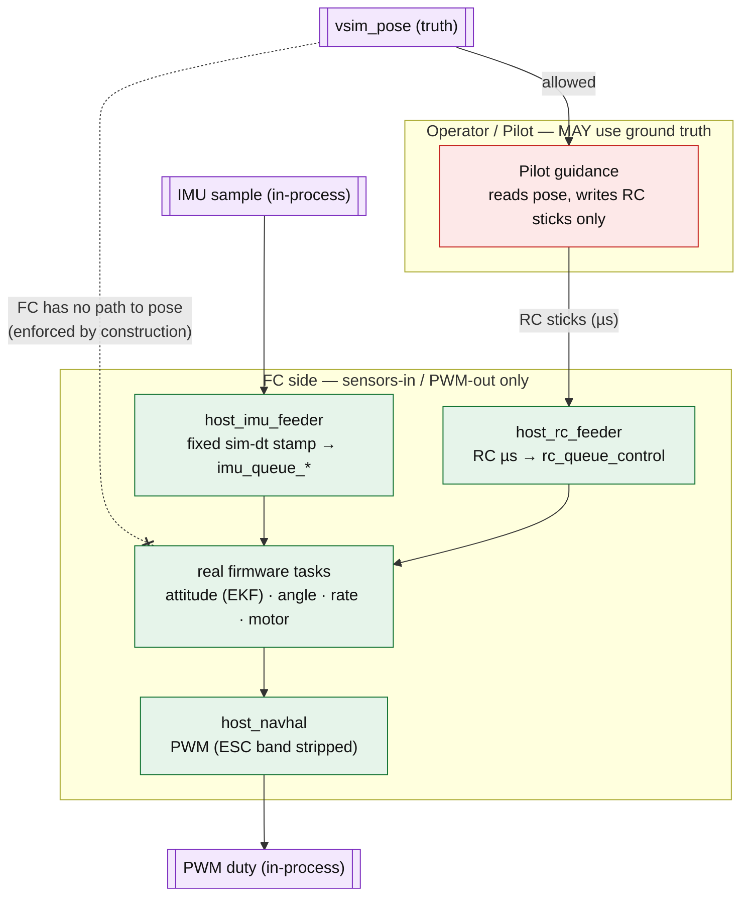
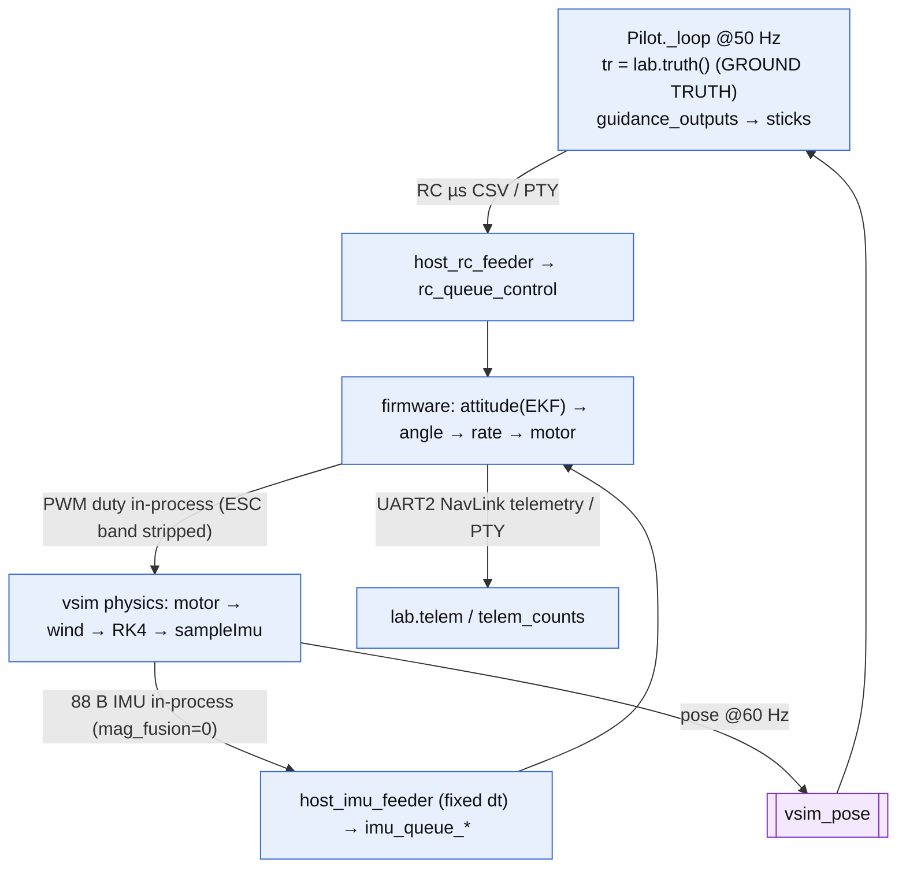

# Sim & SITL architecture (with the Pilot scripting API)

A complete map of the simulation stack: `vayu_sitl_rtos` — the **real firmware** and the
vsim physics **fused into one in-process binary** — how it runs headlessly (SITL), the
seam that keeps the FC honest, and the **`vayu_headless` Pilot**, the Python API you
script flights with. Verified against `sim/vsim/`, `sim/host/`, and
`navigator/headless-sdk/`.

> Companion docs: firmware internals → [`firmware/docs/reference/software-flow.md`](../../../../firmware/docs/reference/software-flow.md);
> wire protocol → [`../../include/vsim_proto.h`](../../include/vsim_proto.h);
> the GCS that also hosts this sim in-process → [`../../../../navigator/docs/reference/gcs-architecture.md`](../../../../navigator/docs/reference/gcs-architecture.md).

## One binary, two processes at run time

SITL is a **single binary**, `vayu_sitl_rtos`: it runs the real firmware on the actual
vaios scheduler (ucontext port) with the vsim physics **linked in**, so the FC↔physics
loop closes with direct calls — no FIFO, no second process. The standalone `vsim_d`
physics daemon and the old pthread `vayu_sitl` host have been retired; the vsim physics
now lives as the `vsim_phys` static lib (`sim/vsim/src/{sim_controller,physics_core,
motor_model,sensor_models}.cpp`) linked into `vayu_sitl_rtos` via `sim/host/`.

| Component | Where | Role |
|---|---|---|
| **vayu_sitl_rtos** | `sim/host` → `vayu_sitl_rtos` (real firmware + `vsim_phys`) | The FC **and** the plant fused: rigid-body physics, sensor synthesis, world/wind, run against the real control logic in one deterministic process. |
| **driver / Pilot** | `navigator/headless-sdk` → `vayu_headless` | Orchestration: spawns `vayu_sitl_rtos` in **driver mode**, injects RC, reads telemetry + ground truth, flies trajectories, scores fidelity. |

In **driver mode** (`VAYU_RTOS_SCENARIO=driver`) the binary is a drop-in for the old
daemon+host pair over the **same wire contract**: two `/tmp` **FIFOs** (`pose` out, `ctl`
in) plus two **PTYs** (UART2 telemetry advert, RC), isolated per session by
`VSIM_FIFO_SUFFIX` (e.g. `_lab<pid>`) so concurrent runs never collide. The former
`pwm`/`imu` FIFOs are gone — that hop is now in-process.

---

## 1. Processes & transport



The PWM/IMU exchange is now a direct in-process call every sample. On the wire, only
`vsim_pose` (**latest-wins** — a slow reader drops stale frames) and `vsim_ctl`
(**lossless**, `pollNext`, because the startup burst — rates, geometry, world, wind —
must all apply) remain; both carry the `VSIM_FIFO_SUFFIX`.

> **GCS in-process variant:** when Navigator links `vayu_sitl_rtos_core` *inside* itself
> instead of spawning the binary, there are no FIFOs/PTYs at all — pose and UART2
> telemetry are delivered by in-process callbacks. See the GCS doc, "In-app sim hosting".

*Source: `sim/host/src/host_rtos_main.c` (`run_driver`, `driver_dispatch_ctl`),
`sim/host/src/vsim_inproc.cpp`, `sim/vsim/include/vsim_proto.h`,
`navigator/headless-sdk/vayu_headless/session.py`, `vayu_headless/paths.py`.*

---

## 2. The in-process physics step (per IMU sample)

The physics (`vsim_inproc.cpp`, wrapping `sim_controller`/`physics_core`) is stepped once
per IMU sample by the RTOS stepper — not by a free-running daemon thread. Sim time is the
sample count, so there is no `clock_nanosleep` pacing inside the loop (rates default 1 kHz
IMU / 8 kHz physics / 60 Hz pose, still live-reconfigurable via `SET_RATES`). In **driver
mode** the outer loop drains the `ctl` FIFO and emits the `pose` FIFO around each step.



### CTL opcodes (driver/viewer → physics; `vsim_proto.h`)

| # | Opcode | Effect |
|--:|--------|--------|
| 1 | `RESET` | respawn pose/vel; `seed≠0` re-seeds sensor+wind RNG (deterministic) |
| 2 | `PAUSE` | freeze physics |
| 3 | `SET_NOISE` | per-sensor σ + enable (enable=0 → dropout) |
| 5 | `SET_GEOMETRY` | mass + inertia[9] + 4 motor mounts |
| 6 / 10 / 11 | `SET_WORLD` / `SET_WORLD_MESH` / `CLEAR_WORLD_MESH` | gravity/ground/drag; mmap BVH world |
| 7 / 8 | `CLEAR_OBSTACLES` / `ADD_OBSTACLE` | primitive obstacles |
| 9 | `SET_RATES` | live re-rate imu/physics/pose |
| 12 | `SET_TESTRIG` | autotune attitude rig (soft tether `tether_k`) |
| 13 | `SET_FAULTS` | per-motor kill + imu dropout |
| **14** | **`SET_WIND`** | steady + gust + Dryden turbulence |

*Source: `sim/host/src/vsim_inproc.cpp`, `sim/vsim/src/{sim_controller,physics_core}.cpp`,
`sim/host/src/host_rtos_main.c`.*

---

## 3. The SITL seam (what keeps the FC honest)

The contract still holds even though the FC and the physics now share one process: **the
FC is sensors-in / PWM-out only and must behave exactly as on real hardware**; the
operator/Pilot *may* use ground truth. The firmware code paths only ever receive the
**IMU** sample (injected in-process) and **RC** (over PTY / queue), and write **PWM** back
inline — they **never** touch the **pose** ground truth. Pose is produced on the physics
side and handed only to the operator/driver loop; the firmware has no path to it, so the
seam is enforced by construction.



*Source: `sim/host/src/host_imu_feeder.c`, `host_navhal.c`, `host_rtos_main.c`,
`sim/host/src/vsim_inproc.cpp`.*

---

## 4. End-to-end data flow (one closed loop)



The control loop closes once per IMU sample (1 kHz). Pose and UART2 telemetry are the
read-only taps the script consumes — **ground truth** (`truth()`) vs the **FC's own
estimate** (`telem["AttitudeEuler"]`) are read separately, which is how fidelity is scored.

---

## 5. Pilot — the scripting API

`vayu_headless` is the installable package you script against. Public surface
(`vayu_headless/__init__.py`): `SitlLab` (a.k.a. `SitlSession`), `Pilot`, `DEFAULT_GAINS`.

```mermaid
sequenceDiagram
    autonumber
    participant S as your script
    participant L as SitlLab (session)
    participant P as Pilot
    participant FC as vayu_sitl_rtos (firmware + physics)

    S->>L: SitlLab(gcs=False, wind=..., rig=False)
    L->>FC: spawn vayu_sitl_rtos (driver mode); push reset/geometry/world/wind (ctl); wire RC + UART2 PTYs
    S->>P: Pilot(lab, alt=-5.0)
    S->>P: arm_takeoff(alt=-5.0)
    P->>L: disarm → reset_pose → arm → climb
    loop 50 Hz guidance
        P->>L: tr = truth() (ground truth)
        P->>L: stick + set_rc(swa=2000)
        L->>FC: RC µs over PTY
        Note over FC: firmware ↔ physics<br/>PWM/IMU in-process
        FC-->>L: pose (ground truth) over FIFO
        FC-->>L: NavLink telemetry over PTY
    end
    S->>P: goto(waypoints), wait reached_last
    S->>L: read truth() and telem
    S->>P: land()
```

Minimal mission (`examples/box_mission.py`):

```python
from vayu_headless import SitlSession, Pilot

with SitlSession(gcs=False) as lab:        # spawns vayu_sitl_rtos (driver mode)
    pilot = Pilot(lab, alt=-5.0)
    pilot.arm_takeoff(alt=-5.0)
    pilot.goto([(s,0),(s,s),(0,s),(0,0)], alt=-5.0)
    while not pilot.reached_last():
        time.sleep(0.2)
    truth = lab.truth()                    # ground-truth pose/vel/att
    fc_est = lab.telem.get("AttitudeEuler")# FC's own estimate
    pilot.land()
```

### API surface

| Call | What it does |
|------|--------------|
| `SitlLab(rig, wind, turb, rc_hz, gcs, attach, vveh)` | start a session (spawns `vayu_sitl_rtos` in driver mode, wires FIFOs/PTYs) |
| `arm(settle)` / `disarm()` | arm / disarm the FC |
| `set_rc(roll,pitch,thr,yaw,swa)` / `stick(...)` | inject RC (raw µs / normalized) |
| `lab.telem`, `lab.telem_counts` | decoded **FC telemetry** (NavLink) + per-message counts |
| `truth()` | **ground truth** `{pos,quat,vel,omega,motor_omega,wind}` (from pose FIFO) |
| `reset_pose(pos)` | teleport the sim body |
| `Pilot(lab, alt, gains, reach)` | guidance autopilot (50 Hz, **writes RC sticks only**) |
| `arm_takeoff` · `goto(wps)` · `reached_last` · `land` | mission primitives |

The CLI wraps the same: `vayu-headless serve | do | run` (`cli.py`). Trajectory generators
(e.g. the Gerono **lemniscate / figure-8**) live in `examples/figure8.py` and feed
`goto` — they are not built into the library.

*Source: `vayu_headless/session.py`, `autopilot.py`, `server.py`, `cli.py`, `examples/`.*

---

## 6. Autotune over sim (brief)

`tools/autotune` drives `vayu_sitl_rtos` **directly over the raw ctl/PTY protocol** (not
the SDK): it spawns its own `vayu_sitl_rtos` in driver mode under an isolated suffix, sends
`SET_TESTRIG` (opcode 12, a *soft* tether so the accelerometer still sees thrust-tilt — a
hard pin over-tunes), runs per-axis step doublets, scores the captured `CONTROL_TRACE`
telemetry, and pushes gains via `CMD_SET_PID`. A faster in-process batch backend
(`rtos_eval.py`, scoring the `#RTOS-TUNE` line) drives the same binary without the wire.
See [`autotune-methodology.md`](autotune-methodology.md).

---

## Reference: transports & key files

The FC↔physics PWM/IMU exchange is **in-process** (direct calls, ~1 kHz). Only the
operator-facing transports remain on the wire in driver mode:

| Transport | Dir | Frame | Rate |
|------|-----|-------|------|
| PWM / IMU | FC ↔ physics | `duty[4]` / 88 B sample | ~1 kHz, in-process (no FIFO) |
| `vsim_pose` FIFO | physics → driver/GCS | pos/quat/vel/omega/wind | 60 Hz latest-wins |
| `vsim_ctl` FIFO | driver → physics | opcode + body | async lossless |

| File | Role |
|------|------|
| `sim/vsim/include/vsim_proto.h` | wire protocol: FIFOs, header, opcodes, payloads |
| `sim/vsim/src/{sim_controller,physics_core}.cpp` | per-step orchestration + RK4 integrator (the `vsim_phys` lib) |
| `sim/host/src/vsim_inproc.cpp` | in-process physics wrapper (`packImu`, ctl config calls, pose emit) |
| `sim/host/src/host_rtos_main.c` | the RTOS stepper + driver-mode ctl/pose FIFO loop |
| `sim/host/src/host_lifecycle.c` | boots the real firmware tasks on the host |
| `sim/host/src/host_imu_feeder.c` | IMU sample → imu queues (fixed sim-dt) |
| `sim/host/src/host_navhal.c` | PWM sink; UART2 telemetry PTY |
| `navigator/headless-sdk/vayu_headless/{session,autopilot,server,cli}.py` | the scripting SDK + Pilot |
| `navigator/headless-sdk/fidelity/*` | maneuver metrics + FC-vs-operator fidelity scoring |

## Notes & caveats (verified)

- **`mag_fusion` is zero in SITL:** `vsim_inproc.cpp`'s `packImu` writes 76 of the 88 IMU
  payload bytes (acc/gyr/mag/raw/temp); the estimator-input `mag_fusion[3]` is left
  zero-filled, so the FC's estimator sees a zeroed fusion-mag in SITL.
  (`sim/host/src/vsim_inproc.cpp`, `vsim_types.h:73-77`.) The host feeder still validates
  the full 88-byte frame layout.
- **Pose v3 fields `airspeed` / `ge_factor` / `batt_*` emit zero** — only `wind_w` is filled.
- The firmware-host I/O comments still mention host-side Mahony; that was **removed** as a
  fidelity violation — the host injects raw IMU only and the firmware's own EKF runs.
- No built-in figure-8/lemniscate in `Pilot`; the generator lives in `examples/`.
