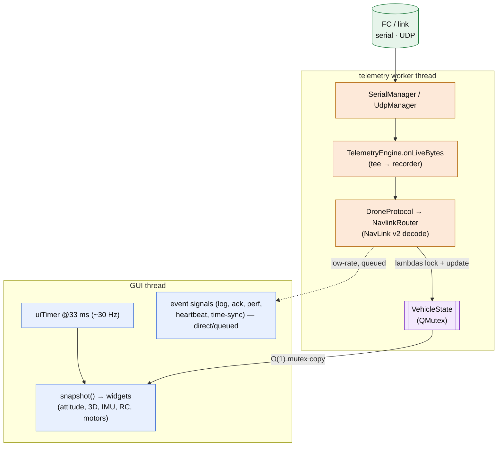
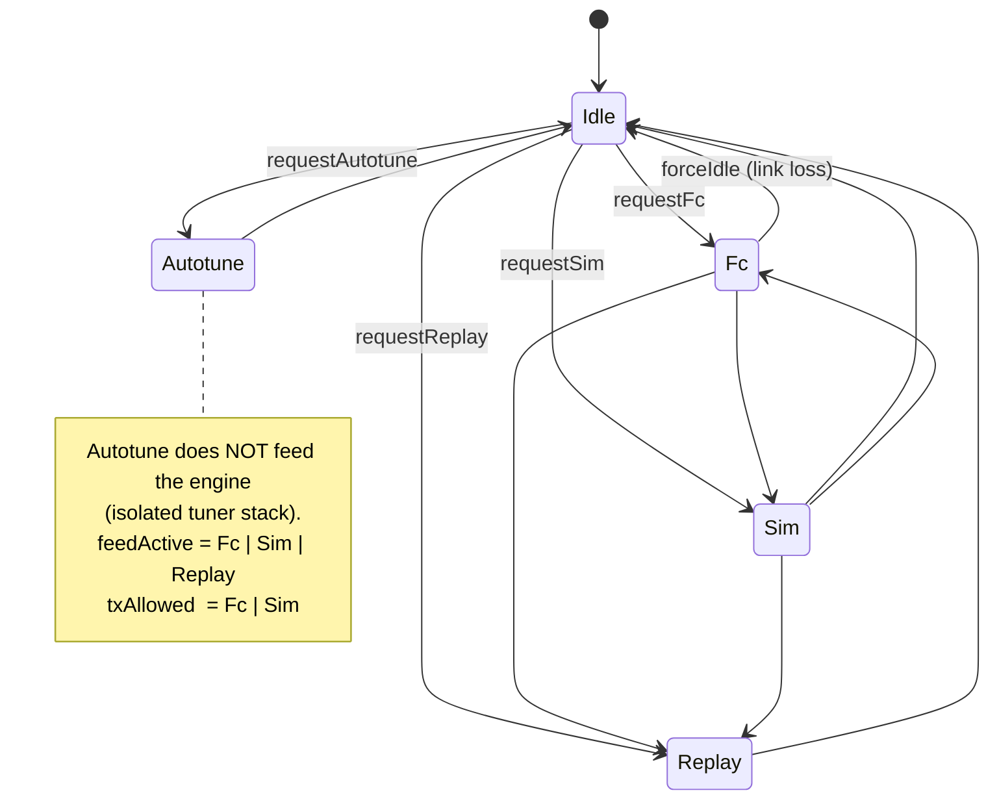
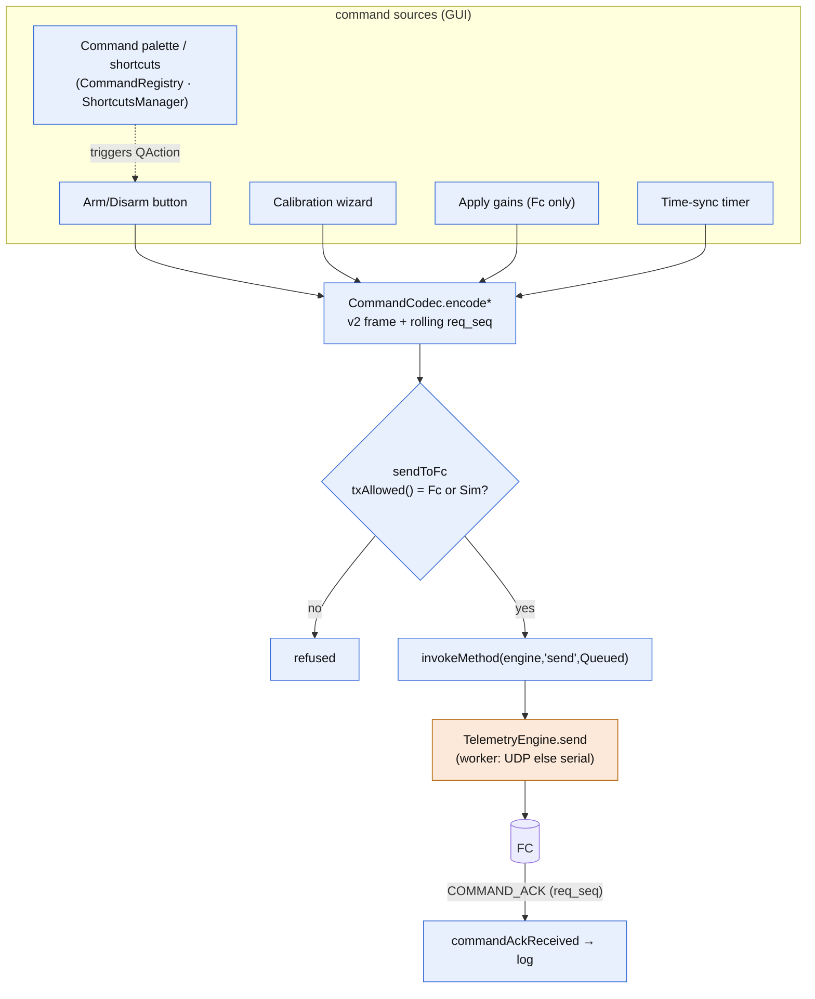
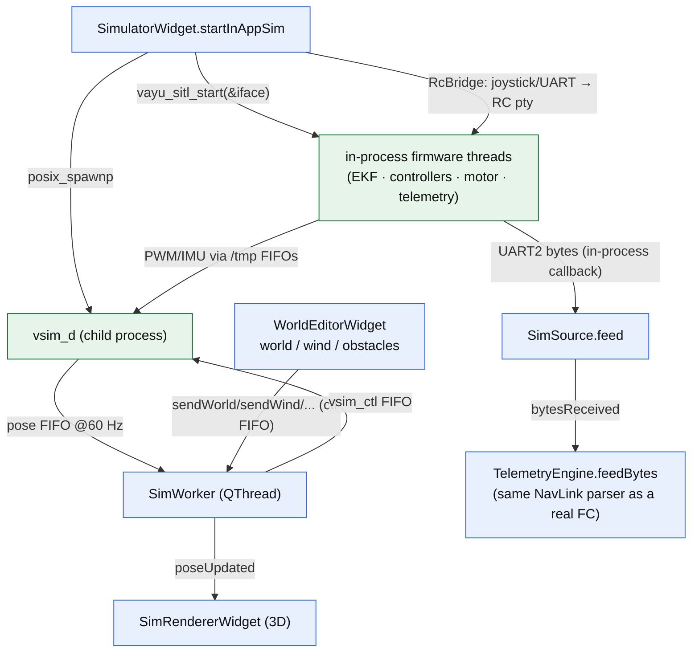
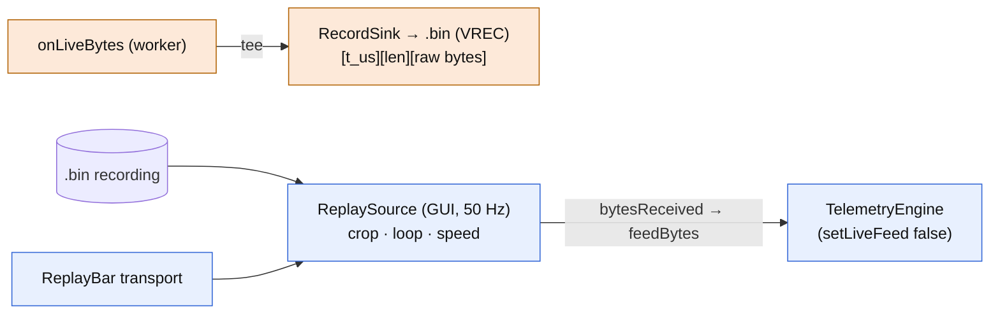

# GCS architecture (Navigator)

A complete map of the Navigator ground station (Qt6): how telemetry sources are
arbitrated, how bytes become UI state across two threads, how commands go out, and
how it hosts the in-app simulator, autotune, and replay. Verified against `software/src/`.

> Companion docs: wire protocol → [`../../../navlink/docs/reference/navlink-v2-spec.md`](../../../navlink/docs/reference/navlink-v2-spec.md);
> firmware internals → [`../../../docs/reference/software-flow.md`](../../../docs/reference/software-flow.md);
> the sim it hosts → [`../../../tools/vsim/docs/reference/sim-architecture.md`](../../../tools/vsim/docs/reference/sim-architecture.md).

**Entry:** `app/main.cpp` → `MainWindow`, which owns everything: a worker-thread
`TelemetryEngine`, the source FSM, the ~30 Hz render clock, the menus, and the single
command tx choke point.

## 1. Architecture & threading

Inbound bytes are parsed on a **worker thread** into a mutex-guarded `VehicleState`;
the GUI samples a `snapshot()` of it at ~30 Hz. Packet rate and render rate are decoupled.

`TelemetryEngine` lives on a `QThread` named `"telemetry"`; its transports are children,
so sockets drain on the worker the instant data arrives. High-rate signals never reach the
UI directly — they update `VehicleState` under the lock; the UI only ever reads `snapshot()`.

*Source: `protocol/TelemetryEngine.{h,cpp}`, `protocol/VehicleState.h`, `ui/main/MainWindow.cpp:59-63,76,1357+`.*

---

## 2. Telemetry-source FSM

Exactly one source feeds the engine at a time. The FSM is Qt/engine-free — it drives
injected hooks; `MainWindow::applyFeed` does the actual swap.

`teardown(old)` always runs before `setup(new)`; a failed setup lands in `Idle`.
Two derived gates are load-bearing: **`txAllowed()` = Fc∨Sim** (the only states that may
send commands) and **`feedActive()` = Fc∨Sim∨Replay**.

> There is no `FcSource`/`AutotuneSource` class: the live FC feed is internal to the engine
> (`setLiveFeed(true)`); only `SimSource` and `ReplaySource` implement `ITelemetrySource`.

*Source: `core/SourceState.h`, `core/SourceController.{h,cpp}`, `ui/main/MainWindow.cpp:833-851`.*

---

## 3. RX decode pipeline (bytes → UI)

```mermaid
flowchart LR
    classDef work fill:#fde9d9,stroke:#b06000,color:#111;
    classDef state fill:#f3e8fd,stroke:#7b2cbf,color:#111;
    classDef gui fill:#e8f0fe,stroke:#3367d6,color:#111;

    B["raw bytes<br/>(live / sim / replay)"]:::work
    B --> SLICE["DroneProtocol.parseBuffer<br/>sync 0x56 · ver 0x02 · 10 B hdr · payload · CRC-16"]:::work
    SLICE --> ROUTER["NavlinkRouter.feed<br/>navlink_parser_push + handler table"]:::work
    ROUTER --> THUNKS["per-msg thunks → GCS structs<br/>(radians→degrees, f16 IMU deltas,<br/>perf reassembly, RC 18→14, motors 8→4)"]:::work
    THUNKS --> HOOKS["std::function hooks → Qt signals<br/>(DroneProtocol)"]:::work
    HOOKS -->|"high-rate"| LAM["TelemetryEngine lambdas<br/>lock + update VehicleState"]:::work
    LAM --> VS[["VehicleState (QMutex)"]]:::state
    VS -->|"snapshot() @30 Hz"| UI["widgets"]:::gui
    HOOKS -.->|"low-rate / event<br/>(log, ack, heartbeat, time-sync, perf)"| UIEVT["GUI slots (queued)"]:::gui
```

The generated NavLink codec is included in exactly two TUs — `NavlinkRouter.cpp` (RX) and
`CommandCodec.cpp` (TX); no other GCS code sees a `navlink_*` type. Records store **raw
byte chunks**, so replay decodes through this exact path (new message types replay for free).

*Source: `protocol/DroneProtocol.cpp:71-113`, `protocol/NavlinkRouter.cpp`, `protocol/TelemetryEngine.cpp:74-153`.*

---

## 4. Command path (GCS → FC)

Every command is a typed NavLink v2 frame from `CommandCodec`, funnelled through one
guarded choke point and executed on the worker thread.

`CommandRegistry` is the UI action layer (one shared `QAction` per command; menus,
toolbar, palette and shortcuts all read from it) — distinct from the FC-encode path.
`req_seq` correlates each `COMMAND_ACK`.

*Source: `protocol/CommandCodec.{h,cpp}`, `ui/main/MainWindow.cpp:811-822`, `core/CommandRegistry.{h,cpp}`.*

---

## 5. In-app sim hosting

Two distinct pieces: the **firmware runs in-process** (linked `libvayu_sitl_core`), and
**`vsim_d` is a child process** supervised by `SimWorker`. They share `VSIM_FIFO_SUFFIX`.

Key subtlety: **the in-app sim's telemetry comes from the in-process firmware's UART2
callback** (→ `SimSource` → engine), *not* from the pose FIFO. The pose FIFO drives only
the 3D renderer. `SimWorker` also supports **attach mode** — reading an external pose FIFO
(a headless `vayu_headless` run or the autotuner) without spawning a daemon.

*Source: `ui/widgets/SimulatorWidget.cpp:2036-2075`, `vsim/SimWorker.{h,cpp}`, `vsim/RcBridge.h`, `comm/SimSource.h`.*

---

## 6. Record / replay

Recording stores **raw inbound bytes** (not decoded packets), so replay is byte-identical
to live. Replay runs through the SourceController (`requestReplay`), which stops any live
recording and — because Replay is not `txAllowed()` — refuses all commands (read-only).

*Source: `replay/RecordFormat.h`, `replay/RecordSink.{h,cpp}`, `replay/ReplaySource.{h,cpp}`.*

---

## 7. UI & autotune (inventory)

`MainWindow` hosts a central `QStackedWidget`; pages map to `Ctrl+1..8`:

| Ctrl | Page |
|:----:|------|
| 1 | Flight Dashboard (attitude ADI/3D, IMU, flight-mode + status, log) |
| 2 | RC Channels · 3 Motors · 4 Control Loop |
| 5 | Packet Analyzer |
| 6 | Simulator (SITL — Vehicle/World/Tuning tabs, 3D, HUD) |
| 7 | Calibration wizard · 8 Kernel Perf |

Plus `MainToolbar`, `MainStatusBar`, `ReplayBar`, `CommandPalette` (Ctrl+Shift+P),
`RecentViewsOverlay` (MRU via `ViewHistory`), `ShortcutsEditorDialog`, `AboutDialog`.

**Autotune** is a native C++ tuner run from the Simulator's Tuning tab. It stands up its
**own isolated** `vsim_d` + `vayu_sitl` (separate suffix, via `autotune/SitlStack`), so it
never feeds the GCS engine (FSM `Autotune`, `feedActive` excludes it). Results plot live
(`ResponsePlot`/`TuneChart`/gains table); applying gains writes `CMD_SET_PID` over a **real
Fc link only**. A `SimWorker` can attach to the tuner's pose FIFO to show its drone in 3D.

*Source: `ui/main/MainWindow.cpp`, `ui/widgets/SimulatorWidget.cpp:1440-1638`, `autotune/SitlStack.{h,cpp}`.*

---

## Notes & caveats (verified)

- **No `FcSource`/`AutotuneSource` class** — the live feed is internal to `TelemetryEngine`;
  only `SimSource` and `ReplaySource` implement `ITelemetrySource`.
- **No literal `engine.setSource()`** — the switch is `MainWindow::applyFeed(SourceState)`
  swapping the single connected source + `setLiveFeed(s==Fc)`.
- The in-app sim is **in-process firmware + child `vsim_d`** (not two child processes); only
  `vsim_d` is spawned (via `posix_spawnp`; the *autotune* stack uses `QProcess`).
- `DroneProtocol.h`'s doc comment describing ASCII `$IMU,...` packets is **stale** — the
  parser is binary NavLink v2 only.
- The generated `navlink_msgs.*` codec is produced at CMake-configure time from
  `navlink/dialect.json`; it is not checked into the source tree.
